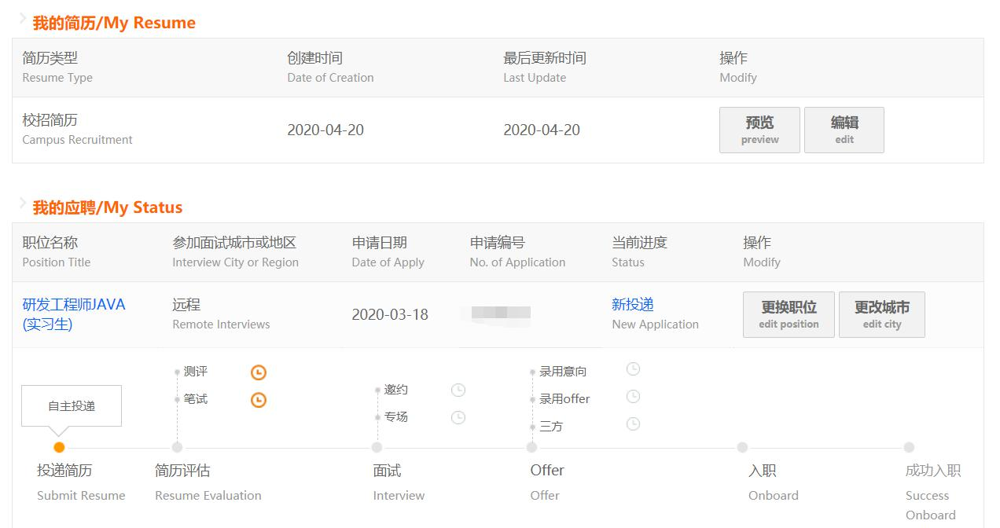

# 开场白
2020，发生了不少的不幸，除了新冠，就还有本次我带来的凉经了。截止至2020年4月20日11:32，我已经面试的公司有腾讯、阿里和字节，一共8场面试，其中最多的是腾讯。虽然场数并不多但是还是
给我带来了很多感悟的。那就让我来回忆一下，希望能对打算阅读的你有所收获吧。

## 3.16 腾讯WXG后台开发：一面 十几分钟
大概就面了十几分钟
首先先和我说部门大部分用的是C/C++的比较多，然后让我自我介绍，然后问了一个linux系统和一个MySQL的问题，一面就这样结束了。
（第一次面试，很紧张，脑子一片空白，表现极差，特别是面试官最后一句“你的情况我都了解了，先这样吧”，让我觉得我原来这么差）

## 3.20 腾讯IEG运营开发：预备面 一个小时
这次面试是在傍晚六点多的时候开始的。其实在那的前一两天，hr已经打电话来问我，他们这个部门我能不能接受，因为我的意向是微信那个部门。我回答可以，然后他说他就把我的
简历给后面的面试官了，但是这次面试并没有进入腾讯官网的面试流程。所以也就相当于提前面，了解情况，看"配不配"进入后面的流程吧。
所以不知道为什么我心里就觉得很不舒服。

大致的面试流程是这样的：

1. 自我介绍
2. 聊项目，主要是问项目拓展方面的问题，比如说问你这个新功能你会怎么做
	
	秒杀系统怎么实现：简单的流程是：下单减库存
	
3. 锁的问题
4. TCP三次握手 四次挥手
5. https流程，没回答上，只说了相当于在多了SSL层进行加密
6. hashtable，concurrentHashmap为什么线程安全
	
	总结： JDK8中的实现也是锁分离的思想，它把锁分的比segment（JDK1.7）更细一些，只要hash不冲突，就不会出现并发获得锁的情况。
	它首先使用无锁操作CAS插入头结点，如果插入失败，说明已经有别的线程插入头结点了，再次循环进行操作。如果头结点已经存在，
	则通过synchronized获得头结点锁，进行后续的操作。性能比segment分段锁又再次提升。
	
7. redis为什么快 -> 单线程的吗? -> 怎么保证数据安全
8. 经典的你有什么问题嘛？
	
	我问他问啥没更新流程，他说他忘记了，他会给我加上的
	
	
整体的面试过程，虽然有点紧张，但是应该表现还可以，因为可能是突击的电话面试，所以没那么紧张。所以就...还行吧
所以晚上的时候，流程更新了，我原本以为更新的流程是“复试”，但是没那么轻松，显示的流程是初试才刚刚开始，我傍晚那个不算初试。
我裂开了。

## 3.21 腾讯IEG运营开发：一面 半个小时
因为这次是提前有通知的，所以我还是不能比较好的调节我的心态、情绪等。所以这次面试很差，出奇的差，不是说不会，是脑子真的空白，好像基本啥都
没学过一样。

还是来看一下吧：

1. 自我介绍，还聊了一下
2. 接口与抽象类区别
	当时紧张了没想到
3. Mysql事务，Java中怎么实现，Spring中用什么注释实现
4. 索引
5. 操作系统常见的命令有哪些 -> 递归的mkdir怎么弄 
6. 实现线程有哪几种方式 
7. 前端了解吗
8. http头有哪些内容 

	不太记得了，就说了，请求方法，请求地址，用户信息，编码方式
9. Spring IOC
10. java反射
	forName Class
11. spring的生命周期
12. 有什么问题

怎么说呢，这次面试表现很差很差，应该是我所有面试里面最差的一次。面试官人还行，除了中途说错了忍不住笑了我一下，其他的还行。
最后问了面试官，面试官说我对自己没什么信心，说话软软的，没底气。我才意识到，原来我在面试官前面是这么的不自信。但是自信还是得建立
在基础上的。不用多说，这次凉了。

## 3.23 腾讯WXG微信客户端IOS开发：一面 两个小时
这次面试我原本以为可以进二面的，但是我后面开始学算法写算法的时候，我发现确实没资格进。因为我连那两道算法题都写了那么长时间，其他的表现还好。

1. 一上来就做题，有两道题，花了差不多一个小时，第一次写题有点紧张，第写的有点久，脑子转不过来。第一题花了差不多二三十分钟。第二道写得有bug
	- 合并数组
	- 从字符串种去除掉指定子字符串，返回剩下的字符数。第二题忘记了一个函数怎么用了
2. 问了我的项目
3. IOS开发的时候我用了什么数据库，我忘记了
	SQLite
4. java的内存管理模型
5. Java垃圾回收机制
6. 线程和进程的区别，什么时候用进程什么时候用线程，你如何选择
7. 死锁怎么解决
8. mysql数据优化
- 这个没答上来，就瞎说了
- 只返回需要的列尽量少用 Select *，
- 只返回必要的行，使用 WHERE 语句进行查询过滤，有时候也需要使用 LIMIT 语句来限制返回的数据。

9. 几种常见的HTTP状态码
10. 说一下几种排序算法和其时间复杂度
11. 算法，从一堆重复的数中找出最大的重复的数。

下面几次的表现还算正常，自己的心态都不错，所以就不加说明了，直接看面试的内容吧。

## 3.25 10点 腾讯视频 安卓客户端开发：一面 一个小时
1. 自我介绍
2. 直接上来问Java，synchronized和lock的区别
3. hashmap和hashtable的区别
4. hashmap线程安全用什么 -> concurrenthashmap
5. hashmap扩容； 解决hash冲突不使用链表可以使用什么
6. synchronized底层是怎么实现的
7. 了解NIO吗
8. 线程的实现方式
这个有点难顶 我说了有三种，Thread、Runnable、Callable
9. 当然会问这几个的线程实现方式的区别，主要是Runnable和Callable的区别
我说了callable有返回值，且不能直接在Thread中使用
10. 当然问到Future，这个我不了解，就知道FutureTask有一个泛型，然后这个是接住Callable的返回
11. 二叉树后序遍历递归和非递归
12. url从短变成长
13. 统计正整数二进制1的个数
14. 单例模式
15. sleep和wait的区别
	
## 3.25 19点 腾讯视频 安卓客户端开发：一面 半个小时
1. 自我介绍
2. 问了项目，围绕数据缓存来问，怎么去淘汰，你怎么设计LRU
3. Java中设计类一般都涉及到哪函数，我说了setter、getter、toString、equals和HashCode
4. 自然会问到HashCode的作用和怎么保证相等和不等
5. Java反射
6. ArrayList、LinkedList、vector的区别
7. String、StringBuffer、StringBuilder的区别
8. 不用递归的快排

## 3.28 13:00 放弃腾讯后台面试

## 3.28 下午五六点 阿里 蚂蚁金服：提前了解情况
1. 自我介绍，介绍项目
2. 问了高并发处理请求怎么实现的
	
	我突然发现，我好像不知道什么是高并发，就知道一个多线程、线程池。没有实际去操作看来还是什么都不懂。所以我打算好好看一下

3. 问了Hash Map的遍历方式
	
	当时在医院打针，蒙了，就乱答了什么链表顺序，然后树中序前序后序
	
## 4.7 字节跳动 一面
1. 一开始就直接看了两个题，为什么说看，因为我没写出来，多多少少说了我的想法、思路。
- 1.统计0-n个数含1的总个数， 这道题是lc的hard
- 2.不知道怎么说，不好意思啊，后面想起来了再加

2. https 和 http的区别，用过域名吗
3. http状态码
 
剩下的不太不记得了，当时忘记做笔记了。问了两个比较正常的问题，然后面试官最后说后面应该还会有hr联系我的。
我对这句话有两个理解，一是你这次凉了，后面其他岗位可能再会捞你；二是你再候选名单，可能你会比较优秀，就通知你继续下面的面试。
我更认为是第二种。这也说明了，这个部门的hc不多了，不是很急需。(小声叹气，唉，我投错了啊)

# 做个总结吧

唉，**腾讯**的提前批已经没了，我还有希望就是后面的正式批了，不过又要笔试。总结一下，腾讯的面试体验相对来说比较差。

**阿里**的呢？3月18日到现在流程也没更新，问了内推人，说我的简历没有完善，但是我确实已经完善了，而且更新了好多次。和我的同学（同意部门，他已经hr面结束了）内容完善程度差不多的，笔试测试也都做了。问了学长说可能是系统的问题，所以
我的流程还是原来的样子（见下图），遇到了系统bug，也是没谁了，与其就这么的无缘吗？**不禁感叹，我太难了，我才二十岁，我好累**。

**美团**和**携程**的，在做完笔试后，至今还没有任何动静，应该是自己太菜了，简历不行。

**斗鱼**之前因为个人原因没有机会参加笔试，所以第一次投递被拒绝了，说是岗位不匹配，后面我又投了应该也是没机会了吧。

**虎牙**和**小米**仅仅也是投了，还没有任何消息。

**字节**，前面暑期实习面一次，凉了。官网的简历暑期实习还是显示简历评估，估计暑期实习这块已经没了。所以我后面投了
字节的日常实习，不过也不容乐观，一开始投了十几个部门岗位，直接挂掉的就有10个左右（应该是没hc了），剩下有一两个的显示了两天**简历筛选**，就直接
**已结束**了。估计是自己的简历每别人的好。剩下的现在还有四个显示简历筛选，一个简历评估。

**华为**，前几天刚刚测评，应该还是有面试的机会的。

尽管前面都失败了，但是后面有机会的话，自己还是回去继续努力的。

怎么说，我从一开始的对实习地点的有要求，到现在的只要给我实习机会都好说的转变，无不透露着自己的实力不足带来的卑微加弱小。

后面我慢慢知道了，还是得慢慢的深入积累，自己知道的还不是很深，从失败中知道自己的不足，并采取什么样的行动，是我这一个多月来不断倒下的最大的收获之一。
当你要问我要不要去参加面试的时候，我会和你说，如果你平时有些许时间准备的话，还是去吧。看别人不如亲自参加来的快。就算没有收获offer，节节败退。
至少可以锻炼我们的心智吧。让我们可以看清自己，明白自己是不是应该这样那样做。

好了，本来想说很多，但是发现突然不知道要说什么了。后面还有的话，我也会不留余力的去分享我的经历给大家的。感谢阅读！

### 写在最后
如果觉得本文对你有帮助的话，可以为我点个赞哈，你的关注和支持是我坚持下去最大的鼓励。 
对文章有什么建议和意见，也欢迎留言告诉我，期待你的回馈。