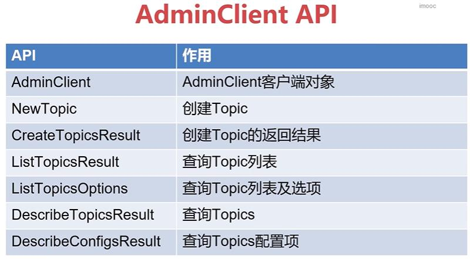

a distributed streaming platform. 分布式流平台。

## 1. zk、jdk、kafka的安装

## 2. Kafka的客户端操作

### 客户端API类型

比较重要的三个
- **AdminClient API**：允许管理和检测Topic、broker以及其他Kafka对象
- **Producer API**：发布消息到一个或多个topic
- **Consumer API**：订阅一个或多个topic，并处理产生的消息。

- Stream API：高效地将输入流转换到输出流。
- Connector API：从一些源系统或应用程序中拉取数据到Kafka

### AdminClient API

常用API

