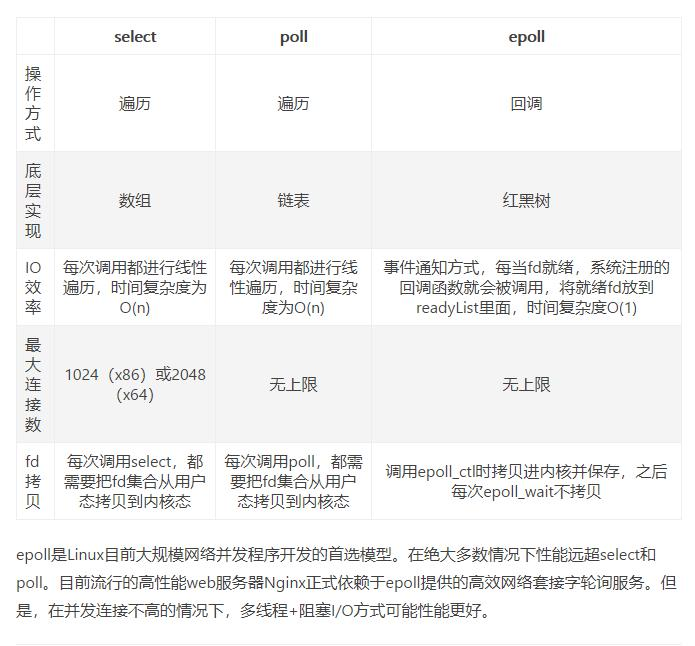

## 前言

在《Unix网络编程》一书中提到了五种IO模型，分别是：阻塞IO、非阻塞IO、多路复用IO、信号驱动IO以及异步IO。

**本文主要是前人大佬的知识总结归纳，仅供学习参考。感谢文中几位大佬的博客**。

[参考博客1：五种IO模型](https://www.jianshu.com/p/486b0965c296)

[参考博客2：缓存IO、直接IO、内存映射](https://www.cnblogs.com/jixp/articles/9437247.html)

[参考博客3：网络IO模型](https://www.jianshu.com/p/a95bcb116765)

[参考博客4：5种网络IO模型（有图，很清楚）](https://blog.csdn.net/u010313909/article/details/80764954)

## 一、概念预知

在了解着五种IO模型之前，我们需要先了解一些涉及到的概念名词。

#### 1. 用户空间和内存空间

现在操作系统都是采用虚拟存储器，那么对32位操作系统而言，它的寻址空间（虚拟存储空间）为4G（2的32次方）。
操作系统的核心是内核，独立于普通的应用程序，可以访问受保护的内存空间，也有访问底层硬件设备的所有权限。
为了保证用户进程不能直接操作内核（kernel），保证内核的安全，操作系统将虚拟空间划分为两部分，一部分为内核空间，一部分为用户空间。
针对linux操作系统而言，将最高的1G字节（从虚拟地址0xC0000000到0xFFFFFFFF），供内核使用，称为**内核空间**，而将较低的3G字节（从虚拟地址0x00000000到0xBFFFFFFF）
，供各个进程使用，称为**用户空间**。

#### 2. 进程切换

为了控制进程的执行，提高CPU的效率，进程切换就会将当前占有CPU的进程挂起，将CPU资源分配给其他的进程。

而进程是由进程控制块 PCB、代码段、数据段组成。PCB 是进程存在的唯一标识。所以进程的切换无非在完成下列三件事情：

1. 更新PCB的内容
2. 将PCB插入到合适的队列中
3. 回收/分配系统资源

#### 3. 文件描述符

文件描述符（File descriptor）是计算机科学中的一个术语，是一个用于表述指向文件的引用的抽象化概念。文件描述符在形式上是一个非负整数。实际上，它是一个索引值，指向内核为每一个进程所维护的该进程打开文件的记录表。


如上图：

由文件描述符转到文件表，由文件表的表项再指向底层的文件。

#### 4. 缓存IO

缓存I/O又被称作标准I/O，大多数文件系统的默认I/O操作都是缓存I/O。在Linux的缓存I/O机制中，数据先从磁盘复制到内核空间的缓冲区，然后从内核空间缓冲区复制到应用程序的地址空间。


- 缓存IO的优点：

  1）在一定程度上分离了内核空间和用户空间，保护系统本身的运行安全；
  2）可以减少读盘的次数，从而提高性能。
  
- 缓存IO的缺点：

  数据在传输过程中需要在应用程序地址空间和缓存之间进行多次数据拷贝操作，这些数据拷贝操作所带来的CPU以及内存开销是非常大的。
  
#### 5. 直接IO

直接IO就是应用程序直接访问磁盘数据，而不经过内核缓冲区，这样做的目的是减少一次从内核缓冲区到用户程序缓存的数据复制。


 直接IO的缺点：如果访问的数据不在应用程序缓存中，那么每次数据都会直接从磁盘加载，这种直接加载会非常慢。

#### 6. 内存映射

[内存映射原理参考](https://www.cnblogs.com/still-smile/p/12155181.html)

是指由一个文件到一块内存的映射。即将硬盘上文件的位置与进程逻辑地址空间中一块大小相同的区域一一对应，当要访问内存中一段数据时，转换为访问文件的某一段数据。

这种方式的目的同样是减少数据在用户空间和内核空间之间的拷贝操作。当大量数据需要传输的时候，采用内存映射方式去访问文件会获得比较好的效率。

## 二、模型详解

### 简介IO

我们常说的IO其实有两种，一种是网络IO，另一种是磁盘IO。

站在操作系统的角度，IO指的是磁盘IO，即读取磁盘的数据。可以分为两个步骤：
1. 第一阶段：等待数据准备，即缓存IO，将磁盘中数据拷贝到内核缓存中；
2. 将数据从内核拷贝到进程。

网络IO也是如此，只不过它是读取的不是磁盘，而是socket。网络IO的本质是socket的读取，socket在linux系统被抽象为流，IO可以理解为对流的操作。也可以分为两个步骤：
1. 第一步：通常涉及等待网络上的数据分组到达，然后被复制到内核的某个缓冲区。
2. 第二步：把数据从内核缓冲区复制到应用进程缓冲区。

### （一）阻塞IO（Blocking IO, BIO）


当用户进程调用了recvfrom这个系统调用，kernel就开始了IO的第一个阶段：准备数据。对于网络 io来说，很多时候数据在一开始还没有到达（比如，还没有收到一个完整的UDP包），这个时候kernel就要等待足够的数据到来。而在用户进程这边，整个进程会被阻塞。当kernel一直等到数据准备好了，它就会将数据从kernel中拷贝到用户内存，然后kernel返回结果，用户进程才解除block的状态，重新运行起来。
    
所以，**blocking IO的特点就是在IO执行的两个阶段（等待数据和拷贝数据两个阶段）都被block了**。

### （二）非阻塞IO（Non-Blocking IO, NIO）


从图中可以看出，当用户进程发出read操作时，如果kernel中的数据还没有准备好，那么它并不会block用户进程，而是立刻返回一个error。从用户进程角度讲 ，它发起一个read操作后，并不需要等待，而是马上就得到了一个结果。用户进程判断结果是一个error时，它就知道数据还没有准备好，于是它可以再次发送read操作。一旦kernel中的数据准备好了，并且又再次收到了用户进程的system call，那么它马上就将数据拷贝到了用户内存，然后返回。
    
所以，**在非阻塞式IO中，用户进程其实是需要不断的主动询问kernel数据准备好了没有**。

非阻塞的接口相比于阻塞型接口的显著差异在于，在被调用之后立即返回。使用如下的函数可以将某句柄fd设为非阻塞状态。
```c
fcntl( fd, F_SETFL, O_NONBLOCK ); 
```

### （三）多路复用IO（IO multiplexing）

IO multiplexing这个词可能有点陌生，但是如果我说select/epoll，大概就都能明白了。有些地方也称这种IO方式为事件驱动IO(event driven IO)。我们都知道，select/epoll的好处就在于单个process就可以同时处理多个网络连接的IO。**它的基本原理就是select/epoll这个function会不断的轮询所负责的所有socket，当某个socket有数据到达了，就通知用户进程**。它的流程如图：


当用户进程调用了select，那么整个进程会被block，而同时，kernel会“监视”所有select负责的socket，当任何一个socket中的数据准备好了，select就会返回。这个时候用户进程再调用read操作，将数据从kernel拷贝到用户进程。

这个图和blocking IO的图其实并没有太大的不同，事实上还更差一些。因为这里需要使用两个系统调用(select和recvfrom)，而blocking IO只调用了一个系统调用(recvfrom)。但是，用select的优势在于它可以同时处理多个connection。（多说一句：所以，如果处理的连接数不是很高的话，使用select/epoll的web server不一定比使用multi-threading + blocking IO的web server性能更好，可能延迟还更大。select/epoll的优势并不是对于单个连接能处理得更快，而是在于能处理更多的连接。）

**多路复用的优势就在于，将判断socket数据准备的情况交给了内核去处理，当有数据准备好时就返回通知用户进程，用户再使用 recvfrom 系统调用去将数据拷贝到进程中，即获取数据**。

多路复用的实现方式有三种，select/poll/epoll，它们之间属于一个升级的关系。文末再进行比较。

### （四）信号驱动式IO（signal-driver IO）

信号驱动式I/O：首先我们允许Socket进行信号驱动IO，并安装一个信号处理函数，进程继续运行并不阻塞。当数据准备好时，进程会收到一个SIGIO信号，可以在信号处理函数中调用I/O操作函数处理数据。

也就是说等待数据阶段应用进程是非阻塞的。内核在数据到达时向应用进程发送 SIGIO 信号，应用进程收到之后在信号处理程序中调用 recvfrom 将数据从内核复制到应用进程中。信号驱动 I/O 的 CPU 利用率很高。过程如下图所示：


### （五）异步IO（Asynchronous IO, AIO）

流程图如下：


用户进程发起read操作之后，立刻就可以开始去做其它的事。而另一方面，从kernel的角度，当它受到一个asynchronous read之后，首先它会立刻返回，所以不会对用户进程产生任何block。
然后，kernel会等待数据准备完成，然后将数据拷贝到用户内存，当这一切都完成之后，kernel会给用户进程发送一个signal，告诉它read操作完成了。

由上可知：

**异步 I/O 与信号驱动 I/O 的区别在于，异步 I/O 的信号是通知应用进程 I/O 完成，而信号驱动 I/O 的信号是通知应用进程可以开始 I/O。**

## 三、多路复用的实现：select、poll、epoll

[参考博客1：select、poll、epoll之间的区别总结](https://www.cnblogs.com/Anker/p/3265058.html)

[参考博客2：大话 Select、Poll、Epoll](https://cloud.tencent.com/developer/article/1005481)

[参考博客3：IO多路复用](https://www.jianshu.com/p/397449cadc9a)

select，poll，epoll都是IO多路复用的机制。I/O多路复用就通过一种机制，可以监视多个描述符，一旦某个描述符就绪（一般是读就绪或者写就绪），能够通知程序进行相应的读写操作。但select，poll，epoll本质上都是同步I/O，因为他们都需要在读写事件就绪后自己负责进行读写，也就是说这个读写过程是阻塞的，而异步I/O则无需自己负责进行读写，异步I/O的实现会负责把数据从内核拷贝到用户空间。

这三者的时间复杂度分别为O(n)、O(n)、O(1)

### （一）select

**关键词：long数组、轮询、1024、用户空间到内核空间**

```c
int select(int nfds, fd_set * readfds, fd_set * writefds, fd_set * exceptfds, struct timeval *timeout);
```
select系统函数中，内核使用数组来保存文件句柄。

（百度百科）select()的机制中提供一fd_set的数据结构，实际上是**long类型的数组**，每一个数组元素都能与一打开的文件句柄（不管是Socket句柄，还是其他 文件或命名管道或设备句柄）建立联系，建立联系的工作由程序员完成。 
当调用select()时，由内核会采用**轮询**的方式，即遍历，去检查 fd_set 数组中每个文件句柄指向的对象（这里指的是socket）的状态，然后根据对象IO状态修改fd_set的内容，由此来通知执行了select()的进程哪一Socket或文件可读或可写。

被监控的fd_set需要进入到内核中进行轮询，所以就需要从用户空间拷贝到内核空间，为了减少数据拷贝带来的性能损坏，内核对被监控的fds集合大小做了限制，并且这个是通过宏控制的，大小不可改变(限制为1024)。

被监控的fds集合中，只要有一个有数据可读，整个socket集合就会被遍历一次调用sk的poll函数收集可读事件。

综上所述，select虽然解决了阻塞带来的性能问题，但是也存在一下这些问题：
1. 被监控的 fd_set 需要从用户空间拷贝到内核空间，影响性能；
2. 数组大小限制为1024；
3. 无论可读的事件有多少，都需要遍历一遍socket。

### （二）poll

**关键字：链表、轮询、用户空间到内核空间**

```C
int poll(struct pollfd *fds, nfds_t nfds, int timeout);
```

poll 的出现解决了select存在的部分问题。poll改变了 select 中 fd_set集合的描述方式，使用了 struct 结构体组成的**链表结构**，文件描述符的数量就没有限制了，不过也就解决了这么一个问题。

它并没改变大量描述符数组被整体复制于用户态和内核态的地址空间之间，以及个别描述符就绪触发整体描述符集合的遍历的低效问题。poll随着监控的socket集合的增加性能线性下降，poll不适合用于大并发场景。


### （三）epoll

**关键字：红黑树、链表、回调**

epoll 的出现就解决 select 全部的问题。

epoll在Linux2.6内核正式提出，是基于事件驱动的I/O方式，相对于select来说，epoll没有描述符个数限制，使用一个文件描述符管理多个描述符，将用户关心的文件描述符的事件存放到内核的一个事件表中，这样在用户空间和内核空间的copy只需一次。

在epoll中主要有三个函数：epoll_create()、epoll_ctl()、epoll_wait()

#### 1. **epoll_create**()

在epoll文件系统建立了个file节点，并开辟epoll自己的内核高速cache区，**建立红黑树存储socket**，分配好想要的size的内存对象，建立一个**list链表**，用于存储准备就绪的事件。

#### 2. **epoll_ctl**()

把要监听的socket放到对应的红黑树上，给内核中断处理程序**注册一个回调函数**，通知内核，如果这个句柄的数据到了，就把它放到就绪列表。

#### 3. **epoll_wait**()

观察就绪列表里面有没有数据，并进行提取和清空就绪列表，非常高效。

下面的图来源于网上：
