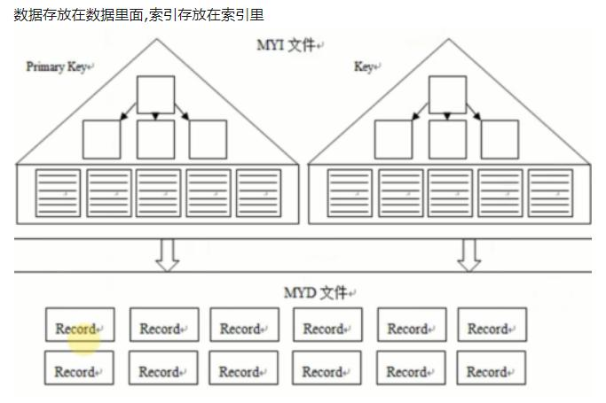

## 一、文件

### 1. 参数文件

  定义：记录数据库文件的位置，指定某些初始化参数（这些参数定义了某些内存结构的类型等设置）

  参数的类型分为：静态和动态
   - 静态参数：说明在整个实例的生命周期内都不可以进行更改，好像是只读的
   - 动态参数：在MySQL实例运行时可以修改
	
### 2. 日志文件

#### 错误日志（error log）

  错误日志文件对MySQL的启动、运行、关闭过程进行记录。该文件不仅记录了所有的错误信息，也记录一些警告信息或是正确的信息。默认情况下错误文件的文件名为服务器的主机名。
	
#### 慢查询日志（slow log）

  慢查询日志可帮助DBA定位可能存在问题的SQL语句。从而从SQL语句的层面优化。
	
#### 查询日志（log）
  
  查询日志记录了所有对MySQL数据库请求的信息，无论请求是否得到了正确的执行。文件为 .log
	
#### 二进制日志（binary log）

  记录了对MySQL数据库执行更改的所有操作，但是不包括　SELECT　和　SHOW　这类操作，因为这类操作对数据本身并没有修改。文件为 name.序列号 
  作用：
  
   - 恢复
   - 复制
   - 审计
  
  binlog_format 的参数值（5.1版本起）：statement、row、mixed
  
  - statement 格式和之前的MySQL版本一样，二进制日志文件记录的是逻辑 SQL 语句
  - row 记录的是表的整行更改情况。
  - mixed 两种混合

  ROW 格式记录了对于整个行更改的信息，即每个地方都记录所有字段的信息，所以会对磁盘空间要求有一定的增加。所以文件的磁盘空间会比 STATEMENT 格式的的文件要大。

#### 中继日志（relay log）
  
  在从服务器上的日志。就是说复制的时候，主服务器任何能够产生数据修改的操作，在写入数据文件的同时，还会把这个语句(也可能是行)记录到二进制日志文件中一份。从服务器就是使用一个用户帐号不断的去连接主服务器，并尝试去读取主服务器上二进制日志中的每一个条目，从服务器将这些挨个的读到从服务器上，在执行之前，先要将这些读到的保存在本地的日志文件中，而后从本地日志文件中读一条执行一条。这个日志文件就叫做中继日志。
  
#### 事务日志

事务日志（InnoDB特有的日志）可以帮助提高事务的效率。使用事务日志，存储引擎在修改表的数据时只需要修改其内存拷贝，再把修改行为记录到持久在硬盘上的事务日志中，而不用每次都将修改的数据本身持久到磁盘。事务日志采用追加的方式，因此写日志的操作是磁盘上一小块区域内的顺序I/O，而不像随机I/O需要在磁盘的多个地方移动磁头，所以采用事务日志的方式相对来说要快得多。事务日志持久以后，内存中被修改的数据在后台可以慢慢的刷回到磁盘。目前大多数的存储引擎都是这样实现的，我们通常称之为预写式日志，修改数据需要写两次磁盘。

### 3. 套接字文件

套接字文件可由参数socket控制。一般在 /tmp 目录下，名为 mysql.sock

Linux平台环境下主要有两种连接方式，一种是TCP/IP连接方式，另一种就是socket连接。

在Windows平台下，有name pipe和share memory（不考虑）两种。

TCP/IP连接是网络中用得最多的一种方式。

### 4. pid文件

  MySQL实例启动时，会将自己的进程ID写入一个PID文件中，默认位于数据库目录下，文件名为 主机名.pid
  
### 5. 表结构定义文件

后缀 .frm

## 二、InnoDB存储引擎文件

### 1. 表空间文件

  InnoDB采用将存储的数据按表空间（tablespace）进行存放。独立表空间的命名规则：表名.ibd。
  
  单独的表空间文件仅存储该表的数据、索引和插入缓存BITMAP等信息。其他的信息还是存放在默认的表空间中。

### 2. 重做日志文件

  重做日志文件，记录了对于InnoDB存储引擎的事务日志。
  
  影响重做日志文件的参数属性：
  
  - innodb_log_file_size : 指定每个重做日志文件的大小。
  - innodb_log_files_in_group : 指定了日志文件组中重做日志文件的数量。
  - innodb_mirrored_log_groups ：制定了日志镜像文件组的数量，默认为1.
  - innodb_log_group_home_dir : 指定了日志文件组所在的路径，默认为 ./。

#### 与 二进制日志文件的区别
 
  1. 二进制日志文件会记录所有与MySQL数据库有关的日志文件，包括InnoDB、MyISAM、Heap等其他存储引擎的日志。而InnoDB存储引擎的重做日志只记录有关该存储引擎本身的事务记录。
  2. 二进制日志记录的都是关于一个事务的具体操作，即该日志的逻辑日志。而innodb存储引擎的重做日志文件记录的是关于每个页（page）的更改的物理情况。

## 三、表

[参考博客1：堆表、索引表、索引聚簇表](https://www.cnblogs.com/youngerger/p/8446399.html)

[参考博客2：堆表、索引表](https://www.cnblogs.com/---wunian/p/9204822.html)

（二级索引无法直接查询所有列的数据，所以通过二级索引查询到聚簇索引后，再查询到想要的数据，这种通过二级索引查询出来的过程，就叫做回表。）

### 1. 索引组织表（index organized table）


  在 InnoDB 存储引擎中，根据主键顺序存放的表，我们叫做索引组织表。索引组织表有一个可变的主B树存储组织。不象普通表(堆组织),数据是无序存储的集合。   
  索引组织表是以主键排序的方式的B树组织结构。
  
  innodb表是索引组织表(Index Organized Table, IOT)，它的索引则是采用 clustered index 方式，因此主键会按照顺序存储，每次有记录有更新时，会重新整理更新其主键。因此无论是直接从 myisam 表转换过来的，还是后来插入的记录，显示时都会按照主键的顺序。
  
  对于 聚集索引 来说，你创建主键的时候，自动就创建了主键的聚集索引。出了主键的聚集索引,其他索引(普通索引)中不会保存行的物理位置,而是保存主键的值,所以通过"二级索引"进行查找是先找到主键,再找到行,要进行二次索引查找。
  
  
### 2. 堆组织表（Heap organized table）



  heap table 就是一般的表，获取表中的数据是按命中率来得到的。没有明确的先后之分，在进行全表扫描的时候，并不是先插入的数据就先获取。数据的存放也是随机的，当然根据可用空闲的空间来决定。
  通常我们建的表默认都是堆表，此类型的表中，数据会以堆的方式进行管理，增加数据时候，会使用段中找到的第一个能放下此数据的自由空间。当从表中删除数据时候，则允许以后的UPDATE和INSERT重用这部分空间，
  它是以一种有些随机的方式使用。
  
  - 堆就是无序数据的集合,索引就是将数据变得有序,在索引中键值有序,数据还是无序的
  - 堆表中,主键索引和普通索引一样的,叶子节点存放的是指向堆表中数据的指针（可以是一个页编号加偏移量）,指向物理地址,没有回表的说法
  - 堆表中,主键和普通索引基本上没区别,和非空的唯一索引没区别
  
  myisam就是用的这个堆表的存储方式,oracle支持堆表,pg只支持堆表
  
### 3. 索引聚簇表（index cluster table）

  聚簇是指：如果一组表有一些共同的列，则将这样一组表存储在相同的数据库块中；聚簇还表示把相关的数据存储在同一个块上。
  利用聚簇，一个块可能包含多个表 的数据。概念上就是如果两个或多个表经常做链接操作，那么可以把需要的数据预先存储在一起。
  聚簇还可以用于单个表，可以按某个列将数据分组存储。
  
### 4. InnoDB 逻辑存储结构

#### 4.1 表空间

  所有数据都被逻辑地存放的空间。由段（segment）、区（extent）、页/块（page/block）、行（row）组成。即逻辑层次结构为 **表空间 > 段 > 区 > 页 > 行**

  段分为数据段（叶子结点）、索引段（非叶子结点，导向作用）、回滚段
  
  区由连续的页组成而成的空间。在任何情况下每个区的大小都为**1MB**。为保证区中页的连续性，InnoDB 存储引擎一次从磁盘申请 4~5 个区。
  在用户启用参数 **innodb_file_per_table** 后，创建的表空间默认大小为 **96KB < 1MB**。那是因为在每段开始时，先用 32 个页大小的碎片页来存放数据，使用完这些碎片页后才是64个连续申请的页。

  页/块在默认的情况下，大小为 16KB。是InnoDB 存储引擎磁盘管理的最小单位。
   
  InnoDB 是面向列数据的，也就是说数据是按照行来进行存放的。每页存放的行记录有硬性定义，每页最多存放 **16KB / 2 - 2000** 行的记录，也就是**7992行**。
  
#### 4.2 InnoDB 行记录格式

在 InnoDB 存储引擎中提供了 **Compact** 与 **Redundant** 两种。

1. **Compact**

  在MySQL5.0中引入的，其设计目标是高效地存储数据。简单的说，就是一个页中的行数据越多，其性能就越高。
  
  其格式：
  
<table>
<tr>
<td>变长字段长度列表（最大不超过2字节）</td>
<td>NULL标志位（1字节，判断是有为NULL）</td>
<td>记录头信息（固定占用5字节）</td>
<td>隐藏列——事务ID列（6字节）</td>
<td>隐藏列——回滚指针列（7字节）</td>
<td>列1数据</td>
<td>列2数据</td>
<td>......</td>
</tr>
</table>

  不管是 CHAR 类型还是 VARCHAR 类型，只要是compact格式，NULL值就不会占用任何存储空间。

2. **Redundant**

  Redundant是MySQL5.0版本之前的InnoDB的行记录方式。

<table>
<tr>
<td>字段长度偏移列表（最大不超过2字节）</td>
<td>记录头信息（固定占用6字节）</td>
<td>隐藏列——事务ID列</td>
<td>隐藏列——回滚指针列</td>
<td>列1数据</td>
<td>列2数据</td>
<td>......</td>
</tr>
</table>

  Redundant行记录格式下，VARCHAR类型的NULL值不占用任何的存储空间，而CHAR类型的NULL值需要占用可能存放的最大值字节数。
  
#### 4.3 InnoDB 数据页结构

1. File Header (文件头) 

  记录页的一些头信息，8个部分组成，共占38字节。

2. Page Header（页头）

  该部分用来记录数据页的状态信息，由14各部分组成，共占用56字节。特别说明，PAGE_INDEX_ID 存储的是数据页中行记录索引的最大值。

3. Infimum 和 Supremun Record

  每个数据页中虚拟的行数据，用来限定行记录的边界。Infimum记录 比该页中的任何记录主键值都要小。Supremum记录是比任何可能大的值还要大的值。
  
4. User Record 和 Free Space

  User Record 是实际存储行记录的内容，**在 InnoDB 中表都是B+数索引组织的**。Free Space 是指空闲空间，在一条记录被删除后，该空间就会被加入到空闲链表中。
  
5. Page Directory

  存放记录的相对位置。

6. File Trailer

  用于检测页是否已经完整地写入磁盘中。只有一个FILE_PAGE_END_LSN 部分，占用8字节。前4字节是该页的 checksum，后4字节和FILE_PAGE_LSN 一样，将两个值进行函数的比较，得出结果。
  
#### 4.4 Named File Formats 机制

  用于解决不同版本下，页结构的兼容性问题。
  
### 5. 约束

  给表提供约束机制，通过增添限制，来保证数据的完整性。[（约束的简述）](http://c.biancheng.net/view/7576.html)
  
  约束的种类：
  - **Primary Key**
  - **Unique Key**    唯一约束与主键约束相似的是它们都可以确保列的唯一性。不同的是，唯一约束在一个表中可有多个，并且设置唯一约束的列允许有空值，但是只能有一个空值。而主键约束在一个表中只能有一个，且不允许有空值。比如，在用户信息表中，为了避免表中用户名重名，可以把用户名设置为唯一约束。
  - **Foreign Key**
  - **Default**
  - **NOT NULL**

特别要注意的是，MySQL不支持传统的 CHECK 约束，但可以通过 ENUM 和 SET 类型来解决部分这样的约束需求。
  
  约束的创建方式：
  - 表建立时就进行约束的定义
  - 利用 ALTER TABLE 命令来进行创建约束

#### 触发器

触发器的作用是在执行 UPDATE、DELETE 和 INSERT 命令前后自动调用SQL命令或存储过程。

创建触发器的命令： CREATE TRIGGER。

#### 外键约束

外键用来保证参照完整性。

一般来说，被引用的表为父表，引用的表称为子表。外键定义时的 ON UPDATE 和 ON DELETE 表示在对父表进行  UPDATE 和 DELETE 操作时，对子表所做的操作，可定义的子表操作有：
- **CASCADE**：表示父表进行 UPDATE 和 DELETE 操作时，对应的子表中的数据也进行 UPDATE 或 DELETE 操作
- **SET NULL**：表示当父表发生 UPDATE 或 DELETE 时，对应的子表中的数据被更新为 NULL。但子表中的列必须允许为NULL。
- **NO ACTION**：表示当父表发生 UPDATE 或 DELETE 时，抛出错误，不允许此类操作发生。
- **RESTRICT（默认）**：表示当父表发生 UPDATE 或 DELETE 时，不允许此类操作发生。


### 6. 视图

在MySQL数据库中，视图（View）是一个命名的虚表，它由一个SQL查询来定义，可以当做表来使用。与正常的持久表（permanent table）不同的是，视图中的数据没有实际的物理存储。

### 7. 分区表

分区的过程是将一个表或索引分解为多个更小、更可管理的部分。MySQL数据库支持的分区类型为水平分区
- 水平分区，指将同一表中的不同行的记录分配到不同的物理文件中。
- 垂直分区，指将同一表中的不同列的记录分配到不同的物理文件中。

当前MySQL支持的分区类型：

- **RANGE分区**：行数据基于属于一个给定连续区间的列值被放入分区。MySQL5.5开始支持 RANGE COLUMNS 的分区。
- **LIST分区**：与 RANGE 分区类型一样，只是 LIST 分区面向的是离散的值。
- **HASH分区**：根据用户自定义的表达式的返回值来进行分区，返回值不能为负数。
- **KEY分区**：根据MySQL数据库中提供的哈希函数来进行分区。

#### 7.1 RANGE 分区

这是最常见的一种分区类型。如下：
```sql
CREATE TABLE t (
	id INT
)ENGINE = INNDB
PARTITION BY RANGE(id)(
PARTITION p0 VALUES LESS THAN(10),
PARTITION p1 VALUES LESS THAN(20)
);
```

主要用于日期列的分区。需要注意的是对于RANGE分区的查询，优化器只能对YEAR()，TO_DAYS()，TO_SECONDS()，UNIX_TIMESTAMP()这类函数进行优化选择。

#### 7.2 LIST 分区

与 RANGE 分区十分的相似，只是分区列的值是离散的，而非连续的。

如果插入的值不在分区的定义中，MySQL数据库同样会抛出异常。

另外，在用 INSERT 插入多行数据的过程中遇到分区未定义的值时，MyISAM 和 InnoDB 存储引擎的处理完全不同。MyISAM 会将之前的行数据都插入，但之后的数据不会被插入。
而 InnoDB 存储引擎将其视为一个事务，因此任何数据都不会插入。

#### 7.3 HASH 分区

HASH 分区的目的是将数据均匀地分布到预先定义的各个分区中，保证各分区的数据量大致都是一样的。

#### 7.4 Key 分区

与 HASH　分区不同之处在于，Key　分区使用　MySQL数据库提供的函数进行分区。

#### 7.5 COLUMNS 分区

这个类型可视为是 RANGE 和 LIST 的一种进化，COLUMNS 分区可以直接使用非整型数据进行分区，分区根据类型直接比较而得，不需要转化为整型。

#### 7.6 子分区

MySQL数据库允许在 RANGE 和 LIST 分区下再进行 HASH 和 KEY 分区。如下
```sql
CREATE TABLE t (a INT, b DATE)ENGINE=INNDB
PARTITION BY RANGE(YEAR(b))
SUBPARTITION BY HASH(TO_DAYS(b))
SUBPARTITIONS 2 (
PARTITION p0 VALUES LESS THAN(1990),
PARTITION p1 VALUES LESS THAN(2000),
PARTITION P2 VALUES LESS THAN MAXVALUE
);
```

MySQL数据库允许对null值进行分区。MySQL数据库的分区总是视 null 值小于任何一个非 null 值，这和 MySQL 数据库中处理 null 值的 order by 操作是一样的。

在 RANGE 分区中 null 值放入的是最小的那个分区，而在 LIST 分区下使用 NULL 值，则必须显示地指出哪个分区中放入 NULL 值，否则会报错。

HASH 和 Key 分区对于 NULL 值的处理是，任何分区的函数都会将含有NULL的记录返回为0值。

#### 7.7 分区与性能

对于 **OLAP（在线分析处理）** 应用，分区可以很好地提高查询地性能，因为OLAP应用大多数查询需要频繁地扫描一张很大的表。如果使用了分区，就只需要扫描相应的分区即可。

对于 **OLTP（在线事务处理）**应用，一般情况下不需要返回很多地数据，大部分都是通过索引返回几条记录，而根据B+树索引可以知道，一张大表，一般的B+树需要2~3次磁盘IO，因此不需要进行分区到多个表空间文件中。


## 四、索引与算法

### 1. 索引概述

InnoDB 支持的索引有 B+ 树索引、全文索引、哈希索引。

innodb 支持的哈希索引是自适应的，存储引擎会根据表的使用情况自动为表生成哈希索引，不能人为的干预是否生成哈希索引。

B+ 树索引并不能找到一个给定值所在的具体的行，只能找到被查找数据所在的页。

### 2. B+ 树索引

B+ 树索引在数据库中的特点是高扇出性，因此在数据库中，B+ 树的的高度一般都在 2~4层，所以查找某一值的行记录是最多只需要 2 ~ 4 次 IO。

B+ 树索引分为 聚集索引 和 辅助索引（非聚集索引）

#### 2.1 聚集索引

聚集索引是按照每张表的主键构造一棵B+ 树，同时叶子节点中存放的即为整张表的行记录数据。也称聚集索引的叶子节点称为数据页。

InnoDB是聚集索引组织表，它的聚集索引选择规则是这样的：
  1. 首先选择显式定义的主键索引做为聚集索引;
  2. 如果没有，则选择第一个不允许NULL的唯一索引;
  3. 还是没有的话，就采用InnoDB引擎内置的ROWID作为聚集索引;

对于 聚集索引 来说，你创建主键的时候，自动就创建了主键的聚集索引。出了主键的聚集索引,其他索引(普通索引)中不会保存行的物理位置,而是保存主键的值,所以通过"二级索引"进行查找是先找到主键,再找到行,要进行二次索引查找。

多数情况下，查询优化器倾向于采用聚集索引。

如果聚集索引必须按照特定的顺序存放物理记录，则维护的成本就会非常的高，因为需要预留空间，当连续的磁盘空间不足时，有需要转移全部的数据，插入删除操作时又得调整。因此，聚集索引的存储并不是物理上的连续的，而是逻辑上的连续。

聚集索引的优点，对于主键的排序查询和范围查找速度非常的快。


#### 2.2 辅助索引

当通过辅助索引来寻找数据时，InnoDB存储引擎会遍历辅助索引，并通过叶级别的指针获得指向主键索引的主键，然后再通过主键索引来找到一个完整的行记录。


#### 2.3 B+ 树索引的分裂

插入页中后根据中值，将数据页中的数据分为左右两边，中值数据放入到索引页中。

### 3. 哈希索引

innodb 中使用hash算法来对字典进行查找，用链表方式解决冲突，哈希函数使用除法散列方式（取模）。哈希索引只能用来搜索等值的查询，对于范围查找无能为力。根据查询的情况自适应的创建哈希索引。

### 4. 全文索引

全文索引是将存储于数据库中的整本书或整篇文章中的任意内容信息查找出来的技术。


## 五、锁

### 1. lock 与 latch

#### **Latch**

latch 一般称为闩锁（轻量级的锁），因为其要求锁定的时间必须非常短。若持续的时间长，则应用的性能会非常的差。

在 InnoDB 存储引擎中 latch 又分为 mutex （互斥锁）和 rwlock （读写锁）。其目的是用来保证并发线程操作临界资源的正确性，并且通常没有死锁检测的机制。

#### **Lock**

lock 的对象是事务，用来锁定的是数据库中的对象，如表、页、行。而且一般lock的对象仅在 commit 和 rollback 后进行释放。（不同事务的隔离级别释放的时间点可能不一样）

innoDB 中有两种锁，行锁与表锁。

#### 一致性非锁定读

是指通过行多版本控制的方法来读取当前执行时间，数据库中的行数据。即不需要等待锁，直接通过读取快照数据来获取所需行数据。

**快照数据**是指该行的之前版本的数据，该实现是通过 undo 段（表空间数据段、索引段、rollback(undo)段中的一段）来实现的。而 undo 用来在事务中回滚数据，因此快照数据本身没有额外的开销。

一个行记录可能不止一个快照数据，一般称这种多版本的快照数据技术为行多版本技术。由此带来的并发控制称为**多版本并发控制（Multi Version Concurrency Control，MVCC）**

在事务隔离级别 READ COMMITTED 和 REPEATABLE READ（默认级别）下，InnoDB 使用的是一致性非锁定读。但是使用的快照数据版本并不相同。在 **READ COMMITTED** 下，非锁定一致性读总是读取被锁定行**最新一份**快照数据；而在**REPEATABLE READ**中，读取的是**事务开始时**行数据版本。

#### 一致性锁定读

默认情况下，SELECT是属于非锁定一致性读。但有时候我们需要显示地加锁，innodb支持两种操作，必须在事务中：
- SELECT...FOR UPDATE 加X锁
- SELECT...LOCK IN SHARE MODE 加S锁

### 2. 锁算法

InnoDB存储引擎有3种行锁的算法，分别是：
- **Record Lock**：单个行记录的锁
- **Gap Lock**：间隙锁，锁定一个范围，但不包含记录本身
- **Next-Key Lock**：Gap Lock + Record Lock，锁定一个范围，并且锁定记录本身。

Next-Key Lock 的设计目的是为了解决幻读（phantom problem）。当查询的索引含有唯一属性是，InnoDB存储引擎会对 Next-Key Lock 进行优化，将其降级为 Record Lock，即仅锁住索引本身，而不是范围，从而提高了并发性。

默认的隔离级别 REPEATABLE READ 使用 Next-Key Lock 的方式来加锁。而事务隔离级别 READ COMMITTED 仅采用 Record Lock 来加锁。


#### 解决 Phantom Problem （幻读）

幻读是指在同一事务下，连续执行两次同样的SQL语句可能导致不同的结果，第二次的SQL语句结果可能会返回之前不存在的行。

InnoDB存储引擎采用Next-Key Locking机制来避免幻读。而Oracle数据库，可能需要在SERIALIZABLE的事务隔离级别下才能解决。


### 3. 锁问题（3种）

#### 3.1 脏读

脏读指的是在不同的事务下，当前事务可以读取到另外一个事务未提交的数据，简单来说就是读到了脏数据。脏数据指的是，事务对缓冲区中的行记录进行修改，但并未被提交的数据。

#### 3.2 不可重复读

不可重复读是指在一个事务内多次读取同一数据集合，多次读取到的数据不一致的情况。

不可重复读与脏读的区别是：脏读是读到未提交的数据；而不可重复读是读到已提交的数据，但是其违反了数据库事务一致性的要求。

使用Next-Key Lock 算法可以避免不可重复读的现象。

#### 3.3 丢失更新

### 4. 死锁

### 5. 锁升级

是指将当前锁的粒度降低。例如：行锁->页锁->表锁

## 六、事务

### 1. 事务简述

InnoDB存储引擎中的事务符合ACID四个特性。原子性（atomicity）、一致性（consistency）、隔离性（isolation）、持久性（durability）

事务一共有 扁平事务、带保存点的扁平事务、链事务、嵌套事务、分布式事务 五种事务。

1. **扁平事务**

  所有操作都在同一层次，其由 BEGIN WORK 开始，由COMMIT WORK 或 ROLLBACK WORK 结束，其间的操作都是原子的，要么都执行，要么都回滚。

  扁平事务的主要限制的不能提交或是回滚事务的某一部分，或是分成几个步骤提交。
  
2. **带有保存点的扁平事务**

  此事务除了支持扁平事务支持的操作外，允许在十五执行过程中回滚到同一事务中的较早的一个状态，即回滚至保存点。
  
  **保存点**用来通知系统应该记住事务当前的状态，以便当之后发生错误时，事务等回到保存点当时的状态。使用 SAVE WORK 函数来建立。保存点在事务内部时递增的。
  
  
3. **链事务**

  思想是：再、在提交一个事务时，释放不需要的数据对象，将必要的处理上下文隐式地传给下一个要开始的事务。
  
4. **嵌套事务**

  嵌套事务是由若干事务组成的一棵树，子树可以是嵌套事务，也可以是扁平事务。处于叶子结点的是扁平事务。
  
5. **分布式事务**

  在分布式环境下运行扁平事务。指的是允许多个独立的事务资源（关系型数据库系统）参与到一个全局事务中。事务的隔离级别必须设置为串行化（SERIALIZABLE）。
  
### 2. 事务的实现

事务的隔离性是由前面的锁来实现的。原子性、一致性、持久性则通过数据库的 redo log 和 undo log 来完成。redo 和 undo 的作用都可以看作是一种恢复操作，redo 恢复提交事务修改的页操作（物理），而 undo 回滚行记录到某一个特定的版本。
redo 通常是物理日志，记录的是页的物理修改操作；undo 是逻辑日志，根据每行记录进行记录。undo 中有 redo 的记录。

#### redo 日志

重做日志用来实现事务的持久性。其有两个部分组成：一是内存中的重做日志缓冲（redo log buffer），可知它是容易丢失的。二是重做日志文件，在磁盘中，是持久的。

redo log基本上都是顺序写的，在数据库运行时不需要对redo文件进行读取操作。为确保每次日志都能写入到重做日志中，在每次重做日志缓冲写入重做日志文件后，InnoDB都会调用一次fsync操作。由于重做日志文件打开并没有使用 O_DIRECT 选项
，所以重做日志缓冲就会先写入到文件系统缓存中。所以重做日志的写入顺序可以视为 **重做日志缓冲->文件系统缓存->重做日中文件**。

**二进制日志文件与redo日志文件的区别**
- redo日志是在InnoDB层产生的，而二进制日志是在MySQL数据库的上层产生的，二进制不仅仅针对于InnoDB存储引擎，任何存储引擎对数据库的更改都会产生二进制日志。
- 二进制日志是一种逻辑日志，其记录的是对应的SQL语句；而重做日志是物理格式日志，其记录的是对于每页的修改。

**redo格式与存储**

重做日志缓冲与重做日志文件都是以块（block）的方式进行保存的，大小为512B，称为重做日志块。除了日志本身，由日志块头（12B）、日志块尾（4B）、日志本身组成（492B）。

#### undo 日志

undo 日志记录的是当前事务中相关操作，当回滚时，再进行相反的操作。除了回滚外，undo日志的另一个作用就是实现MVCC（多版本并发控制）。


**undo log 格式**

undo分为：
- insert undo log

- update undo log

### 事务的隔离级别

- READ UNCOMMITTED
- READ COMMITTED
- REPEATABLE READ
- SERIALIZABLE
