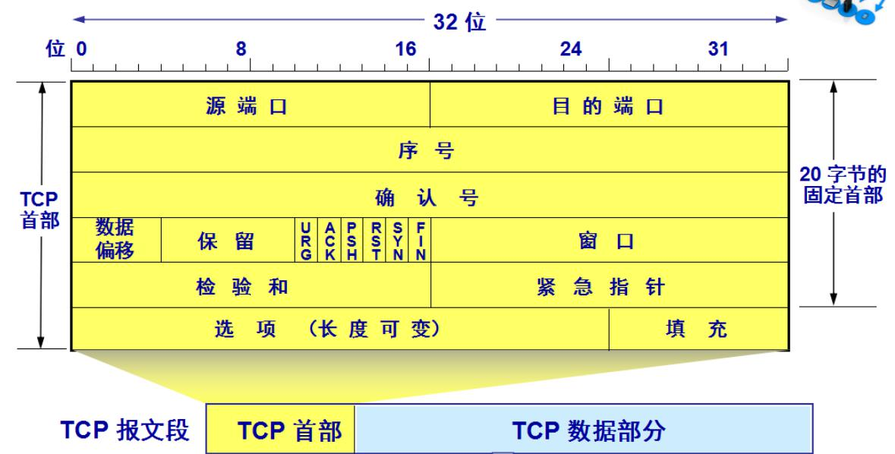

@[TOC]

## 一、UDP

UDP协议全称是用户数据报协议，在网络中它与TCP协议一样用于处理数据包，是一种无连接的协议。
在OSI模型中，在第四层——传输层，处于IP协议的上一层。UDP有不提供数据包分组、组装和不能对
数据包进行排序的缺点，也就是说，当报文发送之后，是无法得知其是否安全完整到达的。

### 首部格式

### 特点

1. 面向无连接

首先 UDP 是不需要和 TCP一样在发送数据前进行三次握手建立连接的，想发数据就可以开始发送了。并且也只是数据报文的搬运工，不会对数据报文进行任何拆分和拼接操作。

具体来说就是：

- 在发送端，应用层将数据传递给传输层的 UDP 协议，UDP 只会给数据增加一个 UDP 头标识下是 UDP 协议，然后就传递给网络层了

- 在接收端，网络层将数据传递给传输层，UDP 只去除 IP 报文头就传递给应用层，不会任何拼接操作

因为面向无连接，所以不会重传，延迟就不会太大，适合流媒体，实时应用等

2. 有单播、多播、广播的功能

UDP 不止支持一对一的传输方式，同样支持一对多，多对多，多对一的方式，也就是说 UDP 提供了单播，多播，广播的功能。

3. UDP面向报文

发送方的UDP对应用程序交下来的报文，在添加首部后就向下交付IP层。UDP对应用层交下来的报文，既不合并，也不拆分，而是保留这些报文的边界。因此，应用程序必须选择合适大小的报文

4. 不可靠性

首先不可靠性体现在无连接上，通信都不需要建立连接，想发就发，这样的情况肯定不可靠。

并且收到什么数据就传递什么数据，并且也不会备份数据，发送数据也不会关心对方是否已经正确接收到数据了。

再者网络环境时好时坏，但是 UDP 因为没有拥塞控制，一直会以恒定的速度发送数据。即使网络条件不好，也不会对发送速率进行调整。这样实现的弊端就是在网络条件不好的情况下可能会导致丢包，但是优点也很明显，在某些实时性要求高的场景（比如电话会议）就需要使用 UDP 而不是 TCP。

UDP只会把想发的数据报文一股脑的丢给对方，并不在意数据有无安全完整到达。

5. 头部开销小，传输数据报文时高效

UDP 头部包含了以下几个数据：

两个十六位的端口号，分别为源端口（可选字段）和目标端口

整个数据报文的长度

整个数据报文的检验和（IPv4 可选 字段），该字段用于发现头部信息和数据中的错误

因此 UDP 的头部开销小，只有八字节，相比 TCP 的至少二十字节要少得多，在传输数据报文时是很高效的

### 对应协议

1. DNS：用于域名解析服务，将域名地址转换为IP地址。DNS用的是53号端口。
2. SNMP：简单网络管理协议，使用161号端口，是用来管理网络设备的。由于网络设备很多，无连接的服务就体现出其优势。
3. TFTP(Trival File Tran敏感词er Protocal)，简单文件传输协议，该协议在熟知端口69上使用UDP服务。

## 二、TCP

### 首部格式

- 确认号（acknowledgement number）：确认应答号字段长度为32位。是指下一次应该收到的数据的序列号。实际上，它是指已收到确认应答号减一为止的数据。发送端接收到这个确认应答号以后可以认为在这个序列号以前的数据都已经被正常接收。
- 窗口大小：该字段为16位，用于通知从相同TCP首部的确认应答号所指位置开始能够接收的数据大小（8位字节）。TCP不允许发送超过此处所示大小的数据。不过，如果窗口为0，则表示可以发送窗口探测，以了解最新的窗口大小。但这个数据必须是1个字节。
- ACK(Acknowledgement Flag):该位为1时，确认应答的字段变为有效。TCP规则除了最初建立时的SYN包之外该为必须设置为1。

### 特点
1. 面向连接
2. 点对点传输
3. 面向字节流传输
4. 可靠传输

### 可靠传输协议ARQ

自动重传请求 ARQ 包括了**停止等待协议**、**回退 N 步协议**和**选择重传协议**，后两种结合了窗口机制，属于连续 ARQ 协议。

1. **停止等待协议**

停止等待就是每发送完一个分组就停止发送，等待对方的确认，在收到确认之后再发送下一个分组。停
止等待协议包括了三种情况：

（1）无差错情况
（2）出现差错情况
（3）确认丢失与确认迟到

2. **回退N步协议（GBN） 也叫 滑动窗口协议**

在回退 N 步即 GBN 协议中，允许发送方发送多个分组而不需要等待确认。在 GBN 中发送方看到的序
号可以分为四个范围，**已经发送且被确认的的序号**、**已经发送还未确认的序号**、**允许发送但还未发送的
序号**和**不允许发送的序号**。其中已经发送但还未确认的序号和允许发送但还未发送的序号可以被看作一
个长度为 N 的窗口，随着协议的运行该窗口在序号空间向前滑动，因此 GBN 协议也被称为滑动窗口协
议。

GBN 发送方必须响应三种类型的事件：

- 上层的调用

当上层调用发送方法时，发送方首先检查发送窗口是否已满，即是否有 N 个已发送但未确认的分
组。如果窗口未满，则产生一个分组并将其发送并更新相应变量，如果窗口已满，发送方指需将数
据返回给上层，隐式说明该窗口已满。实际实现中，发送方更可能缓存而不是立即发送这些数据，
或者使用同步机制允许上层在仅当窗口不满时才调用发送方法。

- 收到一个 ACK

在 GBN 协议中，对序号为 n 的分组确认采用累积确认的方式，对按序到达的最后一个分组发送确
认，表明接收方已经正确接收到序号为 n 的以前且包括 n 在内的所有分组。例如发送了序号为
1~5 的五个分组，除了第三个全部收到了，那么确认序号就是 2。

- 超时事件

回退 N 步的名字来源于出现丢失和时延过长时发送方的行为，就像在停止等待协议中那样，如果
超时，发送方会重传所有已经发送但还未确认过的分组。如果收到一个 ACK，但仍有已发送但未
确认的分组，则计时器也会重新启动。

在 GBN 协议中，接收方丢弃所有失序分组，即使是正确接收的也要丢弃，这样做的理由是接收方必须
按序将数据交付给上层。这种做法的优点是接收缓存简单，即接收方不需要缓存任何失序分组。不过丢
弃一个正确失序分组的缺点是随后对该分组的重传也许也会错误，而导致更多的重传。

3. **选择重传协议**

GBN 协议潜在地允许用多个分组填充流水线，因此避免了停止等待协议中的信道利用问题，但是 GBN
本身也存在性能问题，单个分组的差错就能引起 GBN 重传大量分组，许多分组根本没有重传必要。随
着信道差错率的增加，流水线会被不必要重传的分组所充斥。
选择重传即 SR 协议，通过让发送方仅重传那些它怀疑在接收方出错的分组而避免不必要的重传。这种
个别的、按需重传，要求接收方逐个确认正确接收的分组，再次用窗口长度 N 来限制流水线中未完成和
未被确认的分组数。与 GBN 不同的是，发送方已经收到了窗口中对某些分组的 ACK。
接收方将确认一个正确接收的分组，不管是否按序。失序分组将被缓存直到所有丢失分组都收到，这时
才可以将一批分组按序交付上层。

### TCP可靠原理

#### 1. 滑动窗口

滑动窗口以字节为单位。发送端有一个发送窗口，窗口中的序号是允许发送的序号，窗口的后沿是已经
发送并且确认的序号，窗口的前沿是不允许发送的序号。窗口的后沿可能不动（代表没有收到新的确
认），也有可能前移（代表收到了新的确认），但是不会后移（不可能撤销已经确认的数据）。窗口的
前沿一般是向前的，也有可能不动（表示没有收到新的请求或对方的接收窗口变小），也有可能收缩，
但 TCP 强烈不建议这么做，因为发送端在收到通知前可能已经发送了很多数据，此时如果收缩窗口可能
会产生错误。

滑动窗口的状态需要3个指针p1，p2 和 p3。p1 之前的序号表示已经发送并且确认的序号，p1 ~ p2 的序
号表示已经发送但还没有确认的序号，p2 ~ p3 表示允许发送的序号，也叫可用窗口，p1~p3 表示发送
窗口，p3 之后的序号表示不可发送的序号。

发送缓存用来暂时存放发送应用程序传给发送方 TCP 准备发送的数据和已经发送但还没确认的数据。接
收缓存用来暂时存放按序到达的但尚未被应用程序读取的数据以及未按序到达的数据。

**注意三点**：① 发送窗口根据接收窗口设置，但并不总是一样大，还要根据网络的拥塞情况调整。② 对
于不按序到达的数据，TCP 通常存放在接收窗口，等到字节流缺少的字节收到后再按序交付上层应用程
序。③ 接收方必须有累积确认功能，可以减小传输开销，可以在合适的时候发送确认，也可以在自己有
数据需要发送时捎带确认。但是接收方不能过分推迟发送确认，不能超过0.5秒。

#### 2. 流量控制

如果某个应用程序读取数据的速度较慢，而发送方发送得太多、太快，发送的数据就会很容易使连接的
接收缓存溢出，TCP 为它的应用程序提供了流量控制以消除发送方使接收方缓存溢出的可能性。流量控
制是一个速度匹配服务，即发送方的发送速率与接收方的应用程序读取速率相匹配。

TCP 通过**让发送方维护一个接收窗口的变量**来提供流量控制。通俗地说，接收窗口用于给发送方一个指
示，该接收方还有多少可用的缓存空间，因此发送方的发送窗口不能超过接收方给出的接收窗口的数
值。因为 TCP 是全双工通信，在连接两端的发送方都各自维护一个接收窗口。

当接收窗口 rwnd 减小到 0 时，就不再允许发送方发送数据了。但是可能存在一种情况，当发生了零窗
口报文段不久后，发送方的接收缓存又有了一些存储空间，因此又发生了新的报文说明自己的接收窗口
大小，但是这个报文可能会在传输过程中丢失。接收方就会一直等待发送方的非零窗口通知，而发送方
也一直在等待接收方发送数组，形成一种死锁的状态。为了解决这个问题，TCP 为每一个连接设有一个
持续计时器，只要 TCP 连接的一方收到对方的零窗口通知就启动该计时器，到期后发送一个零窗口探测
报文，如果仍为 0 就重新设置计时器的时间，如果对方给出了新的窗口值就可以解决可能出现的死锁问
题。

还有一种问题叫做**糊涂窗口综合症**，当接收方处理接收缓冲区数据很慢时，就会使应用进程间传送的有
效数据很小， 极端情况下有效数据可能只有 1 字节但传输开销却有 40 字节（20字节的 IP 头以及 20 字
节的 TCP 头) ，导致网络效率极低。为了解决这个问题，可以让接收方等待一段时间，使得接收缓存有
足够的空间容纳一个最长报文段或者等到接收缓存已有一半的空闲空间。发送方也不要发送太小的报
文，而是把数据积累成足够大的报文或达到接收方缓存空间的一半时才发送。

#### 3. 拥塞控制

网络中对资源需求超过了资源可用量的情况就叫做拥塞。当吞吐量明显小于理想的吞吐量时就出现了轻
度拥塞，当吞吐量随着负载的增加反而下降时，网络就进入了拥塞状态。当吞吐量降为 0 时，网络已无
法正常工作并陷入死锁状态。拥塞控制就是尽量减少注入网络的数据，减轻网络中的路由器和链路的负
担。拥塞控制是一个全局性的问题，它涉及网络中的所有路由器和主机，而流量控制只是一个端到端的
问题，是两个端点之间通信量的控制。

根据网络层是否为运输层拥塞控制提供显式帮助可以将拥塞控制的方法区分为两种：端到端拥塞控制和
网络辅助的拥塞控制。TCP 使用端到端的拥塞控制，因为 IP 层不会向端系统提供显式的网络拥塞反
馈。TCP 所采取的方法是让每一个发送方根据所感知到的网络拥塞程度来限制其向连接发送数据的速
率。如果一个 TCP 发送方感知到它到目的地之间的路径上没什么拥塞则会增加发送速率，如果发送方感
知到拥塞就会降低其发送速率。限制发送速率是通过拥塞窗口来实现的，它对发送方能向网络中发送流
量的速率进行了限制。判断拥塞是通过超时或者连续接收到 3 个冗余 ACK 实现的。

TCP 的拥塞控制算法主要包括了慢启动、拥塞避免和快恢复。慢启动和拥塞避免是 TCP 的强制部分，
差异在于对收到的 ACK 做出反应时 cwnd 增加的方式，慢启动比拥塞避免要更快地增加 cwnd 的长
度。快恢复是推荐部分，对 TCP 发送方不是必需的。

1. **慢启动**

  在慢启动状态，拥塞窗口 cwnd 的值以一个 MSS 最大报文段开始并且每当传输的报文段首次被确认就
增加一个 MSS。因此每经过一个 RTT 往返时间，拥塞窗口就会翻倍，发送速率也会翻倍。因此 TCP 的
发送速率起始很慢，但是在慢启动阶段以指数增长。
结束慢启动有三种情况：① 如果存在一个超时指示的丢包事件，即发生了拥塞，TCP 发送方就会将
cwnd 设置为 1 并重新开始慢启动过程。它还将慢启动阈值设置为 cwnd/2，即检测到拥塞时将慢启动
阈值设置为拥塞窗口的一半。② 当拥塞窗口达到慢启动阈值时就会结束慢启动而进入拥塞避免模式。③
最后一种结束慢启动的方式是，如果检测到三个冗余的 ACK，TCP 就会执行快重传并进入快恢复状态。

2. **拥塞避免**

  一旦进入拥塞避免状态，cwnd 的值大约是上次遇到拥塞时的值的一半，即距离拥塞可能并不遥远。因
此 TCP 无法再每经过一个 RTT 就将 cwnd 的值翻倍，而是采用一种较为保守的方法，每个 RTT 后只将
cwnd 的值增加一个 MSS。这能够以几种方式完成，一种通用的方法是发送方无论何时收到一个新的确
认，都将 cwnd 增加一个 MSS。
当出现超时时，TCP 的拥塞避免和慢启动一样，cwnd 的值将被设置为 1，并且将慢启动阈值设置为
cwnd 的一半。

3. **快恢复**

  有时候个报文段丢失，而网络中并没有出现拥塞，如果使用慢启动算法就会降低传输效率。这时应该使
用快重传来让发送方尽早知道出现了个别分组的丢失，快重传要求接收端不要等待自己发送数据时再捎
带确认，而是要立即发送确认。即使收到了乱序的报文段后也要立即发出对已收到报文段的重复确认。
当发送方连续收到三个冗余 ACK 后就知道出现了报文段丢失的情况，会立即重传并进入快恢复状态。
在快恢复中，会调整慢启动阈值为 cwnd 的一半，并进入拥塞避免状态。