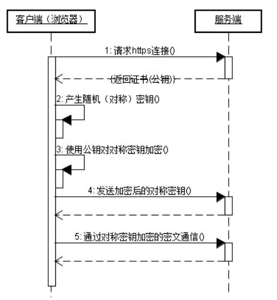

### 一、 HTTP 与 HTTPS 的区别

#### 1. 简介

HTTP　是一种基于文本的传输协议，它位于OSI参考模型的顶层应用层。是一个客户端和服务器端请求和应答的标准（TCP），用于从WWW服务器传输超文本到本地浏览器的传输协议，它可以使浏览器更加高效，使网络传输减少。

HTTPS：是以安全为目标的HTTP通道，简单讲是HTTP的安全版，即HTTP下加入SSL层，HTTPS的安全基础是SSL，因此加密的详细内容就需要SSL。

HTTPS协议的主要作用可以分为两种：一种是建立一个信息安全通道，来保证数据传输的安全；另一种就是确认网站的真实性。

#### 2. 区别

HTTP协议传输的数据都是未加密的，也就是明文的，因此使用HTTP协议传输隐私信息非常不安全，为了保证这些隐私数据能加密传输，于是网景公司设计了SSL（Secure Sockets Layer）协议用于对HTTP协议传输的数据进行加密，从而就诞生了HTTPS。简单来说，HTTPS协议是由SSL+HTTP协议构建的可进行加密传输、身份认证的网络协议，要比http协议安全。即对所有的数据都加密后再进行传输，客户端和服务器端收到加密数据后按照之前约定好的秘钥解密。。

HTTPS和HTTP的区别主要如下：

1. https协议需要到ca申请证书，一般免费证书较少，因而需要一定费用。

2. http是超文本传输协议，信息是明文传输，https则是具有安全性的ssl加密传输协议。

3. http和https使用的是完全不同的连接方式，用的端口也不一样，前者是80，后者是443。

4. http的连接很简单，是无状态的；HTTPS协议是由SSL+HTTP协议构建的可进行加密传输、身份认证的网络协议，比http协议安全。

### 二、 GET 与 POST 的区别

[参考博客](https://mp.weixin.qq.com/s/KE-aDXSuFeSAV-DaXrj8zA)

#### 1. 本质上无差别
HTTP协议中的两种发送请求的方法。

HTTP是什么？HTTP是基于TCP/IP的关于数据如何在万维网中如何通信的协议。

HTTP的底层是TCP/IP。所以GET和POST的底层也是TCP/IP，也就是说，GET/POST都是TCP链接。GET和POST能做的事情是一样一样的。你要给GET加上request body，给POST带上url参数，技术上是完全行的通的。

如果你用GET服务，在request body偷偷藏了数据，不同服务器的处理方式也是不同的，有些服务器会帮你卸货，读出数据，有些服务器直接忽略，所以，虽然GET可以带request body，也不能保证一定能被接收到哦。

好了，现在你知道，GET和POST本质上就是TCP链接，并无差别。但是由于HTTP的规定和浏览器/服务器的限制，导致他们在应用过程中体现出一些不同。

#### 2. 传输数据大小

业界不成文的规定是，（大多数）浏览器通常都会限制url长度在2K个字节，而（大多数）服务器最多处理64K大小的url。

get 是通过URL提交数据，因此GET可提交的数据量就跟URL所能达到的最大长度有直接关系。当发送数据时，GET 方法向 URL 添加数据；URL 的长度是受限制的（URL 的最大长度是 2048 个字符）很多文章都说GET方式提交的数据最多只能是1024字节，而实际上，URL不存在参数上限的问题，HTTP协议规范也没有对URL长度进行限制。这个限制是特定的浏览器及服务器对它的限制。IE对URL长度的限制是2083字节(2K+35字节)。对于其他浏览器，如FireFox，Netscape等，则没有长度限制，这个时候其限制取决于服务器的操作系统。即如果url太长，服务器可能会因为安全方面的设置从而拒绝请求或者发生不完整的数据请求。
	
post 理论上讲是没有大小限制的，HTTP协议规范也没有进行大小限制，但实际上post所能传递的数据量大小取决于服务器的设置和内存大小。因为我们一般post的数据量很少超过MB的，所以我们很少能感觉的到post的数据量限制，但实际中如果你上传文件的过程中可能会发现这样一个问题，即上传个头比较大的文件到服务器时候，可能上传不上去，以php语言来说，查原因的时候你也许会看到有说PHP上传文件涉及到的参数PHP默认的上传有限定，一般这个值是2MB，更改这个值需要更改php.conf的post_max_size这个值。这就很明白的说明了这个问题了

#### 3. 传输次数

GET和POST还有一个重大区别，简单的说：GET产生一个TCP数据包；POST产生两个TCP数据包。

长的说：对于GET方式的请求，浏览器会把http header和data一并发送出去，服务器响应200（返回数据）；
而对于POST，浏览器先发送header，服务器响应100 continue，浏览器再发送data，服务器响应200 ok（返回数据）。
也就是说，GET只需要汽车跑一趟就把货送到了，而POST得跑两趟，第一趟，先去和服务器打个招呼“嗨，我等下要送一批货来，你们打开门迎接我”，然后再回头把货送过去。

因为POST需要两步，时间上消耗的要多一点，看起来GET比POST更有效。因此Yahoo团队有推荐用GET替换POST来优化网站性能。但这是一个坑！跳入需谨慎。为什么？

1. GET与POST都有自己的语义，不能随便混用。

2. 据研究，在网络环境好的情况下，发一次包的时间和发两次包的时间差别基本可以无视。而在网络环境差的情况下，两次包的TCP在验证数据包完整性上，有非常大的优点。

3. 并不是所有浏览器都会在POST中发送两次包，Firefox就只发送一次。

### 三、 怎么理解 session、token、cookie

[理解 session、token、cookie](https://www.cnblogs.com/moyand/p/9047978.html)

#### 1. session

session的中文翻译是“会话”，当用户打开某个web应用时，便与web服务器产生一次session。服务器使用session把用户的信息临时保存在了服务器上，用户离开网站后session会被销毁。这种用户信息存储方式相对cookie来说更安全，可是session有一个缺陷：如果web服务器做了负载均衡，那么下一个操作请求到了另一台服务器的时候session会丢失。

#### 2. cookie

cookie是保存在本地终端的数据。cookie由服务器生成，发送给浏览器，浏览器把cookie以kv形式保存到某个目录下的文本文件内，下一次请求同一网站时会把该cookie发送给服务器。由于cookie是存在客户端上的，所以浏览器加入了一些限制确保cookie不会被恶意使用，同时不会占据太多磁盘空间，所以每个域的cookie数量是有限的。

#### 3. token

token的意思是“令牌”，是用户身份的验证方式，最简单的token组成:uid(用户唯一的身份标识)、time(当前时间的时间戳)、sign(签名，由token的前几位+盐以哈希算法压缩成一定长的十六进制字符串，可以防止恶意第三方拼接token请求服务器)。还可以把不变的参数也放进token，避免多次查库

### 四、HTTP 可以实现安全传输吗？如果可以，如何实现？

[参考博客](https://leetcode-cn.com/circle/discuss/Yjitxs/)

http 在传输 web 内容时确实使用明文形式，但是传输用户的口令时（Password不是密码，称为口令比较正确）是釆取了额外的安全措施的。一般是使用一些加密方式（md5）对口令进行加密即可。但是仅仅对口令加密仍是不够安全的，所以可以在口令中加入一些其他字符，合并之后产生临时口令。

具体做法可以是这样的：在提交登录表单时，pwd 并不是真的口令，它是口令 pwd 与时间t混合后再加密的字符串。这样的话即便被截获也是一个无效的数据。即便截获后知道了破解方式，还可以在后台程序中再设定一个时效限制。

即如果下面三个条件有一个不满足就报错:

- 时间超过两分钟

- uid 不匹配

- pwd 与 t 的组合密码不匹配

所以即使是用 http 方式用户的 pwd（口令）也不是以明文方式在互联网上传输的。

当然 http 协议在保护口令方面存在一些安全隐患，对文本内容更缺乏保护，所以才有了今天普遍釆用的 https 协议。

http 和 https 用了各种密码系统保护用户的帐户安全，用户的身份、口令在互联网传送过程中多是以密文形式出现，它们在信道传输过程中是足够安全的。但是用户的身份、口令等信息在用户的终端和服务器端都是以明文形式存在的，互联网的黑客攻击者的贼眼都盯在客户终端和服务器端上。换言之，今日互联网通信安全问题不在信道上，而是主要在信源和信宿上。

### 五、HTTPS 如何实现安全？

[参考博客](https://www.jianshu.com/p/b0b6b88fe9fe)

#### 1. 什么是 HTTPS ？

https简单的说就是安全版的http，因为http协议的数据都是明文进行传输的，所以对于一些敏感信息的传输就很不安全，为了安全传输敏感数据，网景公司设计了SSL（Secure Socket Layer），在http的基础上添加了一个安全传输层，对所有的数据都加密后再进行传输，客户端和服务器端收到加密数据后按照之前约定好的秘钥解密。

#### 2. 加密和解密

Https的发展和密码学的发展是分不开的。大家应该知道加密方式可以大体分为对称加密和非对称加密。

1. *对称加密*

  双方使用的同一个密钥，既可以加密又可以解密，这种加密方法称为*对称加密*，也称为*单密钥加密*。在对称加密算法中常用的算法有：DES、AES等
  
  这种方式优点就是速度快，缺点就是在管理和分配秘钥的时候不安全，并且当每个用户都使用不同的密钥时，大量的密钥存储就成为了负担。
  
2. *非对称加密*

  一对密钥由公钥和私钥组成（可以使用很多对密钥）。私钥解密公钥加密数据，公钥解密私钥加密数据（私钥公钥可以互相加密解密）。私钥只能由一方保管，不能外泄。公钥可以交给任何请求方。在非对称加密算法中常用的算法有： RSA等。
  
  这种方式的优点是安全，缺点是速度慢。与对称加密恰好相反。
  
  
#### 3. HTTPS 原理

服务器是通过传递SSL证书来传递公钥，客户端会对SSL证书进行验证，其中证书认证体系就是确保SSL安全的关键。

1. CA认证体系

首先会通过层级关系找到上级证书，通过上级证书里的公钥来对服务器的证书指纹进行解密得到签名（sign1），再通过签名算法算出服务器证书的签名（sign2），通过对比sign1和sign2，如果相等就说明证书没有被篡改和伪造。

2. 流程




### 六、HTTP 1.0/1.1/2.0的区别

[参考文章](https://www.jianshu.com/p/52d86558ca57)

#### 1. HTTP 1.0

HTTP 协议老的标准是HTTP/1.0，为了提高系统的效率，HTTP 1.0规定浏览器与服务器只保持短暂的连接，浏览器的每次请求都需要与服务器建立一个TCP连接，服务器完成请求处理后立即断开TCP连接，服务器不跟踪每个客户也不记录过去的请求。但是，这也造成了一些性能上的缺陷，例如，一个包含有许多图像的网页文件中并没有包含真正的图像数据内容，而只是指明了这些图像的URL地址，当WEB浏览器访问这个网页文件时，浏览器首先要发出针对该网页文件的请求，当浏览器解析WEB服务器返回的该网页文档中的HTML内容时，发现其中的图像标签后，浏览器将根据标签中的src属性所指定的URL地址再次向服务器发出下载图像数据的请求。

基于此会发现，http1.0被抱怨最多的就是连接无法复用，和head of line blocking这两个问题。

#### 2. HTTP 1.1

为了克服HTTP 1.0的这个缺陷，HTTP 1.1支持持久连接（HTTP/1.1的默认模式使用带流水线的持久连接），在一个TCP连接上可以传送多个HTTP请求和响应，减少了建立和关闭连接的消耗和延迟。

在http1.1，request和reponse头中都有可能出现一个connection的头，此header的含义是当client和server通信时对于长链接如何进行处理。在http1.1中，client和server都是默认对方支持
长链接的， 如果client使用http1.1协议，但又不希望使用长链接，则需要在header中指明connection的值为close；如果server方也不想支持长链接，则在response中也需要明确说明
connection的值为close。不论request还是response的header中包含了值为close的connection，都表明当前正在使用的tcp链接在当天请求处理完毕后会被断掉。
以后client再进行新的请求时就必须创建新的tcp链接了。

HTTP 1.1在继承了HTTP 1.0优点的基础上，也克服了HTTP 1.0的性能问题。HTTP 1.1通过增加更多的请求头和响应头来改进和扩充HTTP 1.0的功能。如，HTTP 1.0不支持Host请求头字段，WEB浏览器无法使用主机头名来明确表示要访问服务器上的哪个WEB站点，这样就无法使用WEB服务器在同一个IP地址和端口号上配置多个虚拟WEB站点。

HTTP 1.1还提供了与身份认证、状态管理和Cache缓存等机制相关的请求头和响应头。HTTP/1.0不支持文件断点续传，<code>RANGE:bytes</code>是HTTP/1.1新增内容，HTTP/1.0每次传送文件都是从文件头开始，即0字节处开始。<code>RANGE:bytes=XXXX</code>表示要求服务器从文件XXXX字节处开始传送，这就是我们平时所说的断点续传！


#### 3. HTTP 2.0

1. **多路复用 (Multiplexing)**

多路复用允许同时通过单一的 HTTP/2 连接发起多重的请求-响应消息。在 HTTP/1.1 协议中浏览器客户端在同一时间，针对同一域名下的请求有一定数量限制。超过限制数目的请求会被阻塞。这也是为何一些站点会有多个静态资源 CDN 域名的原因之一，拿 Twitter 为例，http://twimg.com，目的就是变相的解决浏览器针对同一域名的请求限制阻塞问题。而 HTTP/2 的多路复用(Multiplexing) 则允许同时通过单一的 HTTP/2 连接发起多重的请求-响应消息。因此 HTTP/2 可以很容易的去实现多流并行而不用依赖建立多个 TCP 连接，HTTP/2 把 HTTP 协议通信的基本单位缩小为一个一个的帧，这些帧对应着逻辑流中的消息。并行地在同一个 TCP 连接上双向交换消息。

2. **服务器推送**

服务端推送是一种在客户端请求之前发送数据的机制。在 HTTP/2 中，服务器可以对客户端的一个请求发送多个响应。Server Push 让 HTTP1.x 时代使用内嵌资源的优化手段变得没有意义；如果一个请求是由你的主页发起的，服务器很可能会响应主页内容、logo 以及样式表，因为它知道客户端会用到这些东西。这相当于在一个 HTML 文档内集合了所有的资源，不过与之相比，服务器推送还有一个很大的优势：可以缓存！也让在遵循同源的情况下，不同页面之间可以共享缓存资源成为可能。

### 七、HTTP 长短连接原理

#### 1. TCP短连接

我们模拟一下TCP短连接的情况，client向server发起连接请求，server接到请求，然后双方建立连接。client向server 发送消息，server回应client，然后一次读写就完成了，这时候双方任何一个都可以发起close操作，不过一般都是client先发起 close操作。为什么呢，一般的server不会回复完client后立即关闭连接的，当然不排除有特殊的情况。从上面的描述看，短连接一般只会在 client/server间传递一次读写操作

短连接的优点是：管理起来比较简单，存在的连接都是有用的连接，不需要额外的控制手段

#### 2. TCP长连接

接下来我们再模拟一下长连接的情况，client向server发起连接，server接受client连接，双方建立连接。Client与server完成一次读写之后，它们之间的连接并不会主动关闭，后续的读写操作会继续使用这个连接。

首先说一下TCP/IP详解上讲到的TCP保活功能，保活功能主要为服务器应用提供，服务器应用希望知道客户主机是否崩溃，从而可以代表客户使用资源。如果客户已经消失，使得服务器上保留一个半开放的连接，而服务器又在等待来自客户端的数据，则服务器将应远等待客户端的数据，保活功能就是试图在服务 器端检测到这种半开放的连接。

```
	connection: keep-alive,
	keep-alive: time-out=20
```

当一个连接“一段时间” (time-out) 没有数据通讯时，一方会发出一个心跳包（Keep Alive包），即服务器就向客户发一个探测报文段，客户主机必须处于以下4个状态之一：

- 客户主机依然正常运行，并从服务器可达。客户的TCP响应正常，而服务器也知道对方是正常的，服务器在两小时后将保活定时器复位。
- 客户主机已经崩溃，并且关闭或者正在重新启动。在任何一种情况下，客户的TCP都没有响应。服务端将不能收到对探测的响应，并在75秒后超时。服务器总共发送10个这样的探测 ，每个间隔75秒。如果服务器没有收到一个响应，它就认为客户主机已经关闭并终止连接。
- 客户主机崩溃并已经重新启动。服务器将收到一个对其保活探测的响应，这个响应是一个复位，使得服务器终止这个连接。
- 客户机正常运行，但是服务器不可达，这种情况与2类似，TCP能发现的就是没有收到探查的响应。

## 八、 TCP/IP编程服务器端主要调用哪些接口

bind、listen、connect、send、read、write、flush、close等等

## 九、HTTP 常见状态码有哪些？

#### 1xx：Informational（信息性状态码），接受的请求正在处理
- **100 Continue**：客户端应当继续发送请求。

#### 2xx：Success（成功状态码），请求正常处理完毕

- **200 OK**：表示从客户端发送给服务器的请求被正常处理并返回。
- **204 No Content**：表示客户端发送给客户端的请求得到了成功处理，但在返回的响应报文中不含实体的主体部分（没有资源可以返回）。

#### 3xx：Redirection（重定向），需要进行附加操作以完成请求

- **301 Moved Permanently**：永久性重定向，表示请求的资源被分配了新的URL，之后应使用更改的URL。
- **302 Found**：临时性重定向，表示请求的资源被分配了新的URL，希望本次访问使用新的URL。

#### 4xx：Client error（客户端错误），客户端请求出错，服务器无法处理请求

- **400 Bad Request**：表示请求报文中存在语法错误。如没有传递必要的参数；参数的类型不匹配。
- **401 Unauthorized**：未经许可，需要通过HTTP认证身份。
- **403 Forbidden**：服务器拒绝该次访问（访问权限出现问题）。如端口号未开放。
- **404 Not Found**：表示服务器上无法找到请求的资源，可能是用户的URL写错。除此之外，也可以在服务器拒绝请求但不想给拒绝原因时使用。

#### 5xx：Server Error（服务器错误），服务器处理请求出错

- **500 Inter Server Error**：表示服务器在执行请求时发生了错误，也有可能是web应用存在的bug或某些临时的错误时。
- **502 Bad Gateway**：作为网关或者代理工作的服务器尝试执行请求时，从上游服务器接收到无效的响应。
- **503 Server Unavailable**：表示服务器暂时处于超负载或正在进行停机维护，无法处理请求。


## 九、输入地址、回车到浏览器显示，这段时间发生了什么？