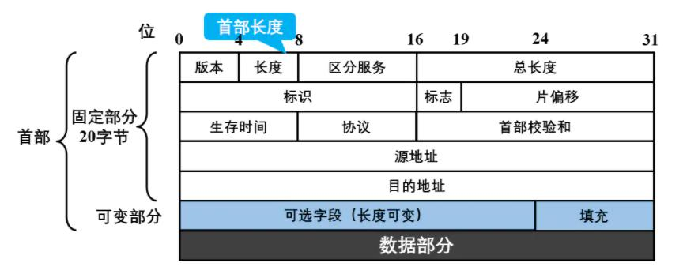

### 一、IP数据报首部格式

- **版本**：占4位，指IP协议的版本。目前广泛使用的IP协议版本有两种IPv4和IPv6。

- **首部长度**：占4位，**其单位是4B**。所以首部长度必须是4B的整数倍。如首部长度字段的4个二进制位分别是1111（对应十进制是15），则IP协议首部的长度是15 × 4B = 60B（字节）。由于IP数据报首部的固定部分长度固定是20，所以首部字段最小从0101开始。

- **区分服务**：占8位，一般情况下不使用该字段。只有使用区分服务时，这个字段才起作用，如要求当前的数据报设置高优先级优先发送。

- **总长度**：占16位，表示首部和数据部分长度之和，**单位是1B**。

- **生存时间**：占8位，表示数据报在网络中的寿命。由发送数据报的源点设置这个字段，其目的是为了防止那些无法交付的数据报无限制的在互联网中兜圈子（例如从路由器R1转发到R2，再转发到R3，然后又转发到R1），因而白白浪费网络资源。数据报每经过一个路由器，这个值就会减1，当减至0时，就丢弃该数据报。

- **协议**：占8位，协议字段是指出次数据报所携带的数据是使用的协议。这里记两个协议字段的值：6表示TCP协议，17表示UDP协议。

- **首部校验和**：占16位，只校验数据报的首部，不检验数据部分。数据报每经过一个路由器都要重新计算一下首部校验和（一些字段，如生存时间、标志、片偏移可能发生了变化）。

