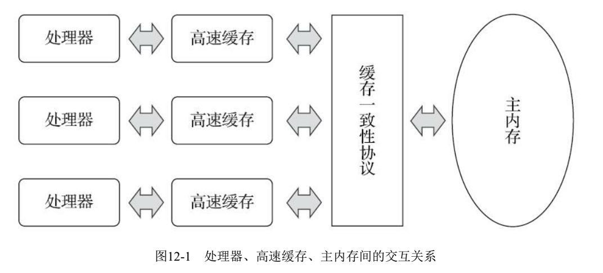
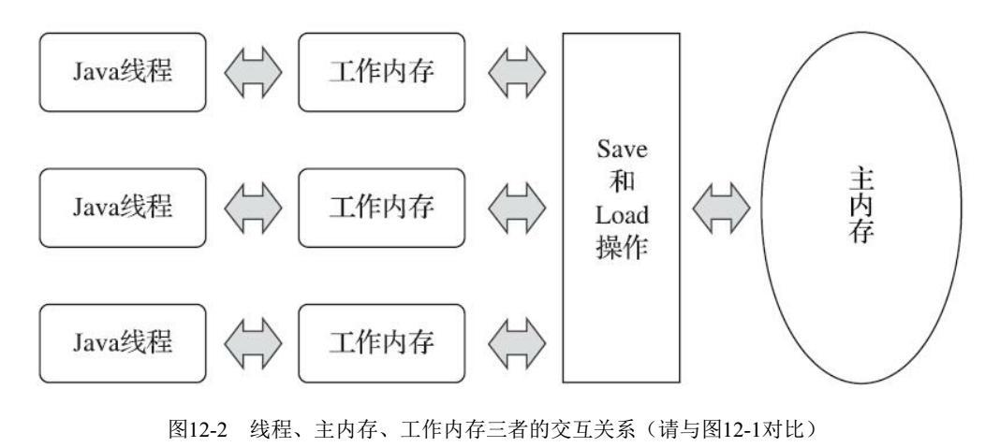

## 一、 Java内存模型的基础

### 1. 总述
**内存模型，我简单的理解就是Java在运行过程中的JVM对内存进行一系列操作的框架或者了流程**（仅代表个人观点）。

在并发编程中，主要需要处理两个关键的问题：**线程之间的通信**、**线程之间的同步**

### 2. 简介

说到Java的内存模型，就不得不和计算机的内存模型相联系起来了。

1. CPU执行过程

大家都知道，计算机在执行程序时，每条指令都是在CPU中执行的，而执行的时候，又免不了要和数据打交道，而计算机上面的临时数据，是储存在主存中的。

计算机内存包括**高速缓存**和**主存**。

我们知道CPU执行指令的速度比从主存读取数据和向主存写入数据快很多，所以为了高效利用CPU，CPU增加了高速缓存(cache)来匹配CPU的执行速度，最终程序的执行过程如下：

 - 首先会将数据从主存中复制一份到CPU的高速缓存中

 - 当CPU执行计算的时候就可以直接从高速缓存中读取数据和写入数据

 - 当运算结束后，再将高速缓存的数据更新到主存中

（下图来源于电子书）

2. Java执行过程（抽象结构）

所以，在Java内存模型中，也是类似的结构，如下图：
（下图来源于电子书）

所以可以知道：

**Java内存模型(Java Memory Model，JMM)**即是Java语言对前面提到的——计算机解决多线程场景下的一个主存操作规范的遵循，JMM规定了所有的变量都存储在主存中，每个线程都有自己的工作区，线程将使用到的变量从主存中复制一份到自己的工作区，线程对变量的所有操作(读取、赋值等)都必须在工作区，不同的线程也无法直接访问对方工作区，线程之间的消息传递都需要通过主存来完成。可以把这里主存类比成计算机内存模型中的主存，工作区类比成计算机内存模型中的高速缓存。

然后通过Java内存模型，在多线程场景下访问主存保证**原子性**、**可见性**、**有序性**。

## 2. 进一步了解Java内存模型

1. 重排序
	- happens-before：
		- 用于阐述操作之间的内存可见性
	- as-if-serial: 不管怎么重排序，单线程程序的执行结果不能被改变

2. 顺序一致性

## 3. 关键词的内存语义
1. volatile
2. synchronized
3. final