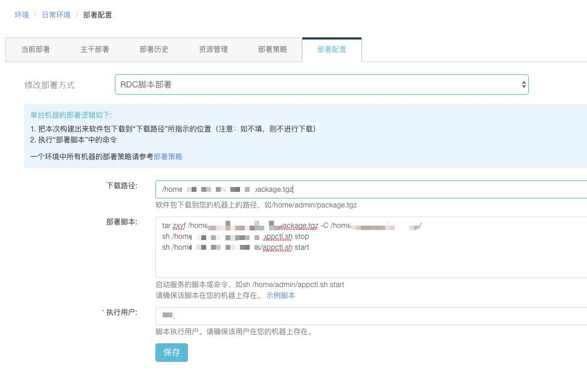

十分钟记录一下自己使用云效的过程

## 创建应用后，使用脚本配置部署到服务器

1. 创建应用后，选择要部署的环境，一共有三个。然后点击 **“资源管理”**，接着选择你的服务器，后面你的应用都会部署到这台机子上

2. 点击 **“部署配置”**，进行脚本配置，此处相当于用命令去运行你的应用，在这里我的应用会被打包成jar包，然后压缩下载到指定路径的指定压缩文件
如下图的 **“/home/.../package.tgz”**

3. 下载到服务器后，就会自动执行上图的 **“部署脚本”** 里面的命令了

4. 总结一下，用此流水线，可以省去你 1）自己打包，然后 2）上传到服务器，3）运行应用这三个步骤。
 
   你可以设置流水线运行的触发条件。我觉得用这个很是方便。