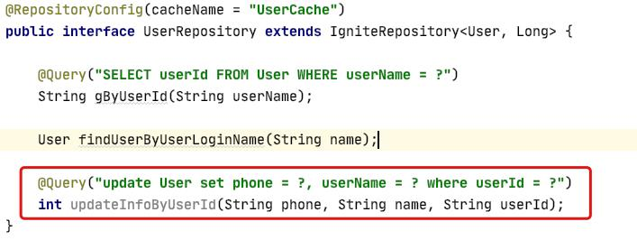
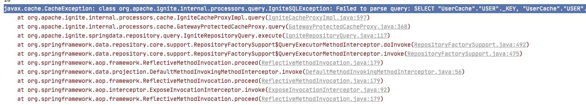
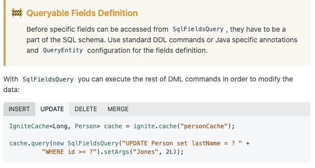

## 一. 说明，亦或是了解情况
前几天，我花了将近一天的时间，把 Spring 和 ignite 整合的问题给解决了。但是今天我继续完善功能的时候，发现了一些问题。

问题是：我在定义的 xxxrepository 接口中没有办法实现更新语句（Update），就像下面这张图红色所展现的:



具体的报错如下：
```java
javax.cache.CacheException: 
	class org.apache.ignite.internal.processors.query.IgniteSQLException: 
		Failed to parse query: 
			SELECT "UserCache"."USER"._KEY, "UserCache"."USER"._VAL FROM "UserCache"."USER" WHERE update User set phone = ?, userName = ? where userId = ?
```


从报错的信息，我们可以看出来：

**实际处理的SQL语句和我们想要的并不一样。我们的目的是 “update ....”。而 ignite 在处理
语句后，自动拼接成了 “select .... where update” 。很容易看出来，这条SQL语句是有问题。**

**从而我们可以知道，[官网](https://apacheignite-mix.readme.io/docs/spring-data)中提示说，通过 *这种接口的方式* 好像无法进行修改（update）。**

如果按照我前一篇文章里面的方法进行操作的小伙伴，不知道你们有没有遇到这个问题。

## 二. 解决问题
那么问题出现了，现在就得解决问题

首先，我们很轻松的从官网的[另一个地方](https://apacheignite-sql.readme.io/docs/java-sql-api)可以找到如何使用SQL语句去实现增删改查



那么怎么在我们原来的基础上去加上这个东西呢？

其实也很简单，简单的说就是，我们先获取到先前创建的cache（缓存），然后创建SQL语句，查询就好了，那让我们一步步来解决吧。

### 1. 先获取先前创建的 Cache 

```java
/**
 * 用户数据库类
 * 
 * @author calesq
 * @date 2020/5/29 12:23
 */
@Component
public class UserDao {
	
    @Resource(name = "igniteInstance")
    private Ignite igniteInstance;

    /**
     * 更新用户信息
     *
     * @param phone
     * @param name
     * @param userId
     */
    public void updateInfo(String phone, String name, String userId) {
        IgniteCache<Long, User> userIgniteCache = igniteInstance.getOrCreateCache("UserCache");

        SqlFieldsQuery query = new SqlFieldsQuery(
                "update User set phone = ?, userName = ? where userId = ?").setArgs(phone, name, userId);
        userIgniteCache.query(query).getAll();
    }
}
```

说明：

因为在 ignite 的配置类中用 **@Bean** 注解注释了 **public Ignite igniteInstance()** 方法，所以在这里，我们只需要通过 **@Resource**
指定 bean 的名称进行注入就可以使用了。（备注：**@Bean** 注解在**不说明 bean 的名称的情况下**就会默认名称为 **首字母小写的方法名**。所以在这里直接通过方法名去指定注入）

这部分是 Spring 的知识，有兴趣或是忘记了的，可以去再温习一下。

### 2. 调用xxDao里的方法
因为我们的 **UserDao** 类通过 **@Component** 进行注释了，所以我们只需要注入，然后就可以调用了。如下：

```java
...
	@Autowired
    private UserDao userDao;
...
	userDao.updateInfo("123","nice", "id");
...
```


## 三. 总结
通过上面这些方法就可以真正实现增删改查了，当然可能还有更好的方法。所以很希望有更好方法的小伙伴可以和我交流一下，让我学习学习。

## 写在最后

大家有问题可以留言一起讨论，觉得文章还不错，可以点个赞，顺手关注一哈。
