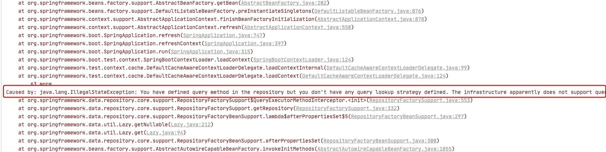
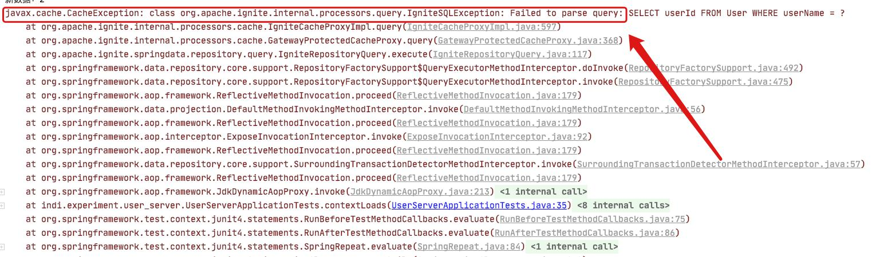
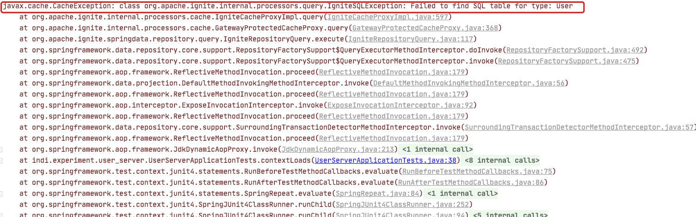
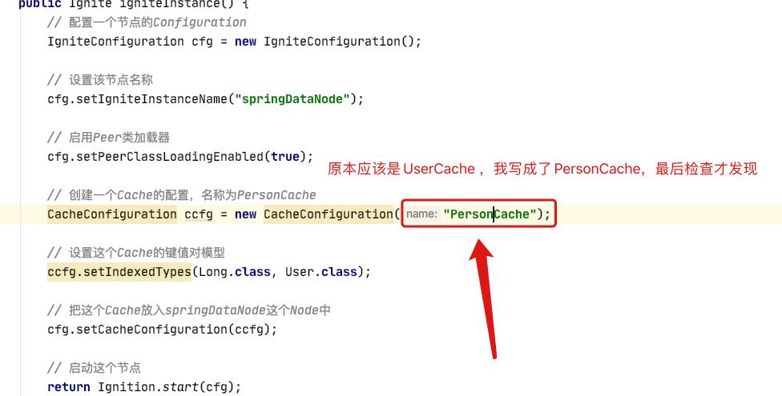

## 一、安装 ignite

1. 下载zip包，需要下载已经编译好的


2. 将安装包解压放到自定义文件夹

3. 配置环境变量(下面是linux机器，Windows不赘述)
 1. 全局变量
	vim /etc/profile
	export IGNITE_HOME=/xxx/apache-ignite-2.8.0-bin
	
 2. 用户
	vi ~/.bash_profile
	export IGNITE_HOME=/xxx/apache-ignite-2.8.0-bin

4. 进入bin目录下，运行 ignite.sh / ignite.bat，如下图显示好像就成功了


## 二、结合 Spring 使用 ignite

### 1. 添加依赖，版本选择

**注意：首先我们选择的Springboot版本是1.5.10.RELEASE，不然会报错！**

```
        <!-- ignite -->
        <dependency>
            <groupId>org.springframework.boot</groupId>
            <artifactId>spring-boot-configuration-processor</artifactId>
            <optional>true</optional>
        </dependency>
        <dependency>
            <groupId>org.apache.ignite</groupId>
            <artifactId>ignite-spring-data</artifactId>
            <version>2.3.0</version>
        </dependency>

        <dependency>
            <groupId>org.springframework.boot</groupId>
            <artifactId>spring-boot-starter-test</artifactId>
            <scope>test</scope>
        </dependency>
```

### 2. 配置ignite

[参考官网链接](https://apacheignite-mix.readme.io/docs/spring-data)

所以看了官网文档我们知道，需要创三个文件

IgniteCfg.java、xxxRepoRepository.java(interface)、实体类.java

如下
```java
@RepositoryConfig(cacheName = "PersonCache")
public interface PersonRepository extends IgniteRepository<Person, Long> {
    /**
     * Gets all the persons with the given name.
     * @param name Person name.
     * @return A list of Persons with the given first name.
     */
    public List<Person> findByFirstName(String name);

    /**
     * Returns top Person with the specified surname.
     * @param name Person surname.
     * @return Person that satisfy the query.
     */
    public Cache.Entry<Long, Person> findTopByLastNameLike(String name);

    /**
     * Getting ids of all the Person satisfying the custom query from {@link Query} annotation.
     *
     * @param orgId Query parameter.
     * @param pageable Pageable interface.
     * @return A list of Persons' ids.
     */
    @Query("SELECT id FROM Person WHERE orgId > ?")
    public List<Long> selectId(long orgId, Pageable pageable);
}
	
	
@Configuration
public class SpringAppCfg {
    /**
     * Creating Apache Ignite instance bean. A bean will be passed
     * to IgniteRepositoryFactoryBean to initialize all Ignite based Spring Data      * repositories and connect to a cluster.
     */
    @Bean
    public Ignite igniteInstance() {
        // 配置一个节点的Configuration
		IgniteConfiguration cfg = new IgniteConfiguration();

		// 设置该节点名称
		cfg.setIgniteInstanceName("springDataNode");

		// 启用Peer类加载器
		cfg.setPeerClassLoadingEnabled(true);

		// 创建一个Cache的配置，名称为PersonCache
		CacheConfiguration ccfg = new CacheConfiguration("UserCache");

		// 设置这个Cache的键值对模型
		ccfg.setIndexedTypes(Long.class, User.class);

		// 把这个Cache放入springDataNode这个Node中
		cfg.setCacheConfiguration(ccfg);

		// 启动这个节点
		return Ignition.start(cfg);
	}
}


public class Person {
	....
}
```


然后需要在项目启动入口，配置@EnableIgniteRepositories注解以支持ignite的@RepositoryConfig，就可以食用了


使用的方法很简单了

1. 在xxxReRepository.java中写你需要的SQL语句或是ignite自有方法
2. 自动注入@Autowired后，直接调用存储类中的方法
```java
@Autowired
private PersonRepository personRepository;

public insertPerson(Person p) {
	...
	personRepository.save(p.getId, p);
	...
}
```


## 三、出现过的一些错误

先说一下，下面的错误不代表我遇到的所有错误，其他的只是我忘记记录了。

1. 在你觉得你的代码和官网的几乎一样时还出现**下面的错误**，应该就是Spring或是依赖版本的问题了


2. 出现下面的问题，先别像我立马度娘，看看你们代码是不是什么地方填错了，一般是那三个文件（IgniteCfg.java、xxxRepoRepository.java(interface)、实体类.java）的某个地方你填错了




例如：


## 写在最后
花了一天的时间，从源源不断的bug中一点一点找到解决的方法，谢谢我看过的博客的笔者们，虽然有时候看的那些博客不沾边没联系。

想了想，还是写个过程，让大家参考一下，希望我上面写的对大家有所帮助。

大家有问题可以留言一起讨论，觉得文章还不错可以，点赞关注哈。