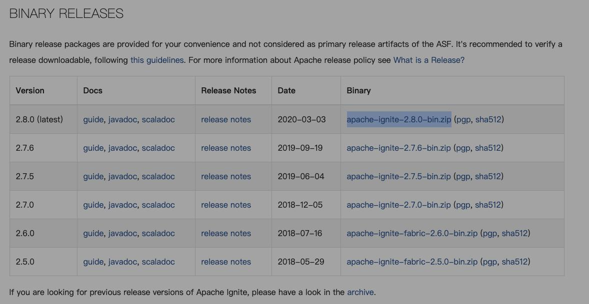
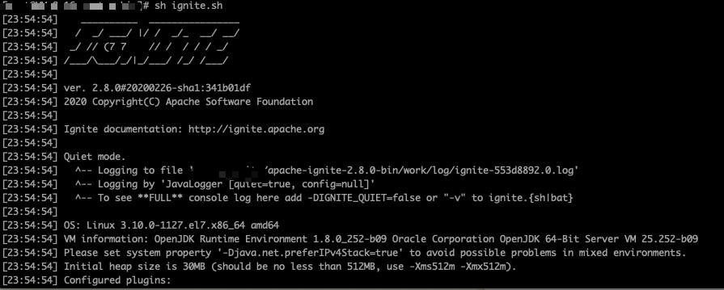

## 一、安装 ignite

1. 下载zip包，需要下载已经编译好的

2. 将安装包解压放到自定义文件夹

3. 配置环境变量(下面是linux机器，Windows不赘述)
 1. 全局变量
	vim /etc/profile
	export IGNITE_HOME=/xxx/apache-ignite-2.8.0-bin
	
 2. 用户
	vi ~/.bash_profile
	export IGNITE_HOME=/xxx/apache-ignite-2.8.0-bin

4. 进入bin目录下，运行 ignite.sh / ignite.bat，如下图显示好像就成功了

## 二、结合 Spring 使用 ignite